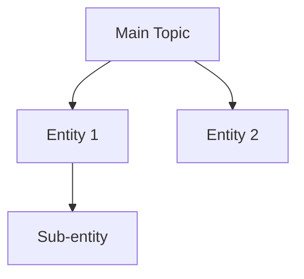

# Entity Extraction Patterns

## Nguồn để tìm Entities

### 1. Google Sources
- **Google Knowledge Panel**: Các entity Google đã nhận diện
- **People Also Ask**: Câu hỏi liên quan chứa entities
- **Suggested Queries**: Query refinements
- **Image Search Bubbles**: Visual entity associations

### 2. Wikipedia/Wikidata
- Infobox data
- Internal links → related entities
- Categories → entity classification

### 3. Other Sources
- YouTube video titles/descriptions
- Forum threads (Reddit, Quora)
- News articles
- Industry reports

---

## Entity Types & Examples

### Person Entities
```
Experts, Authors, Founders, Influencers
→ Ví dụ: "Koray Tugburk Gubur" cho topic "Holistic SEO"
```

### Organization Entities
```
Companies, Institutions, Agencies, Publications
→ Ví dụ: "Google", "Moz", "Ahrefs" cho topic "SEO"
```

### Place/Location Entities
```
Countries, Cities, Regions
→ Ví dụ: "Silicon Valley" cho topic "Startups"
```

### Concept Entities
```
Methods, Frameworks, Laws, Theories
→ Ví dụ: "E-E-A-T", "Core Web Vitals" cho topic "SEO"
```

### Time/Event Entities
```
Dates, Milestones, Updates
→ Ví dụ: "Hummingbird Update 2013" cho topic "Google Algorithm"
```

---

## Entity Relationship Types

| Relationship | Example |
|--------------|---------|
| is-a | "Semantic SEO" is-a "SEO methodology" |
| part-of | "Entity extraction" part-of "Semantic SEO" |
| created-by | "PageRank" created-by "Larry Page" |
| related-to | "Semantic SEO" related-to "NLP" |
| used-for | "TF-IDF" used-for "keyword analysis" |

---

## Output: Entity Map Template

```markdown
# Entity Map: [Topic]

## Primary Entities (High Relevance)
| Entity | Type | Source | Relationship to Topic |
|--------|------|--------|----------------------|
| | | | |

## Secondary Entities (Medium Relevance)
| Entity | Type | Source | Relationship to Topic |
|--------|------|--------|----------------------|

## Entity Relationship Graph
[Mermaid diagram]

```
