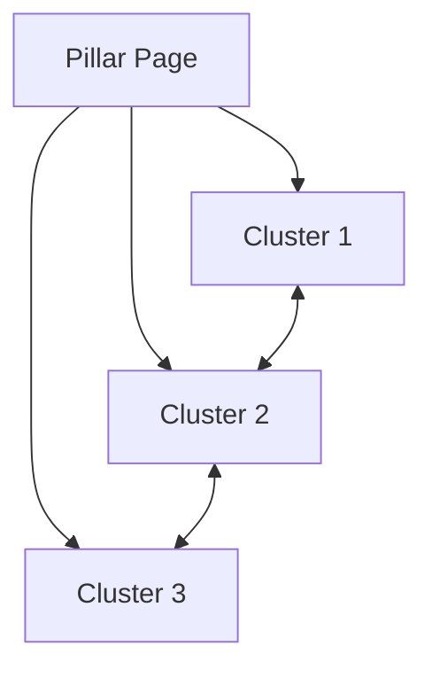

# Output Templates

## Template 1: Full Semantic SEO Strategy

```markdown
# Semantic SEO Strategy: [Topic]

## Executive Summary
- **Target Topic**: [topic]
- **Primary Keyword**: [keyword]
- **Total Content Pieces**: [X]
- **Estimated Timeline**: [X weeks/months]

---

## 1. Entity Map
[Insert Entity Map from Phase 2]

---

## 2. Query Map
[Insert Query Map from Phase 3]

---

## 3. Content Hierarchy

### Pillar Page
- **Title**: [Comprehensive Guide title]
- **URL**: /[topic]/
- **Word Count**: 3000-5000
- **Target Queries**: [list main queries]

### Cluster Pages
| # | Title | URL | Word Count | Target Queries |
|---|-------|-----|------------|----------------|
| 1 | | | 1500-2000 | |
| 2 | | | 1500-2000 | |

### Internal Linking Map


---

## 4. Implementation Timeline

| Week | Action | Deliverable |
|------|--------|-------------|
| 1 | Pillar page outline | Content brief |
| 2 | Pillar page draft | Draft for review |
| 3 | Cluster pages 1-3 | Published content |
| 4 | Internal linking | Optimized links |

---

## 5. Technical SEO Recommendations

### URL Structure
```
/[topic]/                    ← Pillar
/[topic]/[subtopic-1]/       ← Cluster
/[topic]/[subtopic-2]/       ← Cluster
```

### Schema Markup
- Article schema for blog posts
- FAQ schema for question-focused content
- HowTo schema for tutorials

### On-Page Elements
- H1: Include primary entity
- H2s: Map to query clusters
- Internal links: Use descriptive anchor text with entities
```

---

## Template 2: Quick Analysis Report

```markdown
# Quick Semantic Analysis: [Topic]

## Top Entities
1. [Entity 1] - [Type] - [Why important]
2. [Entity 2] - [Type] - [Why important]
3. [Entity 3] - [Type] - [Why important]

## Top 10 Queries to Target
| # | Query | Intent | Priority |
|---|-------|--------|----------|
| 1 | | | |
| 2 | | | |
...

## Quick Wins
- [ ] Add [entity] mentions to existing content
- [ ] Create FAQ section answering [top PAA questions]
- [ ] Internal link to [related pages]

## Next Steps
1. [Immediate action]
2. [Short-term action]
3. [Long-term action]
```

---

## Template 3: Content Brief

```markdown
# Content Brief: [Page Title]

## Target Information
- **Primary Query**: [query]
- **Secondary Queries**: [list]
- **Search Intent**: [Informational/Commercial/etc]
- **Funnel Stage**: [Awareness/Consideration/Decision]

## Content Requirements
- **Word Count**: [range]
- **Format**: [guide/listicle/comparison/etc]
- **Reading Level**: [grade level]

## Must-Include Elements
### Entities to Mention
- [Entity 1] - [how to mention]
- [Entity 2] - [how to mention]

### Questions to Answer
- [Question 1 from PAA]
- [Question 2 from PAA]

### Sections Required
1. [H2: Section name] - [what to cover]
2. [H2: Section name] - [what to cover]

## Internal Linking
- Link TO: [existing pages]
- Link FROM: [pages that should link here]

## Competitive Reference
- [Competitor URL 1] - [what they do well]
- [Competitor URL 2] - [what they do well]
```
