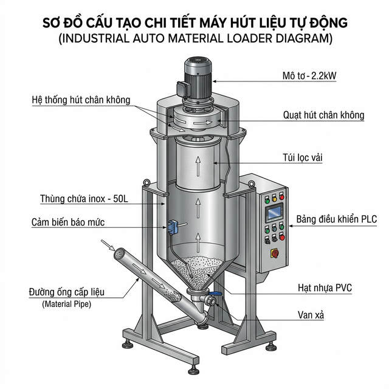
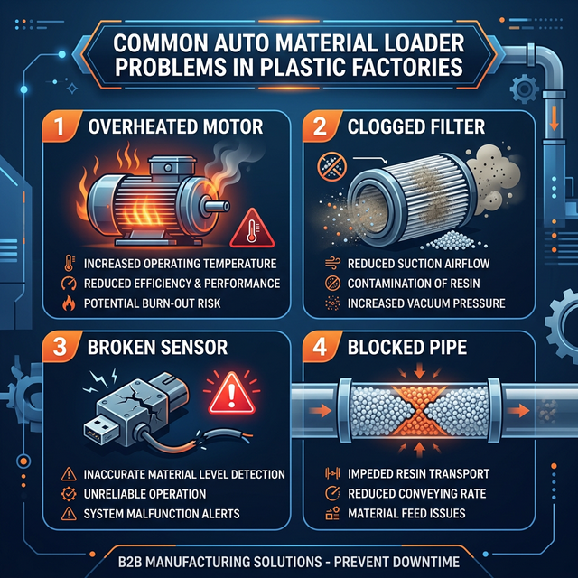
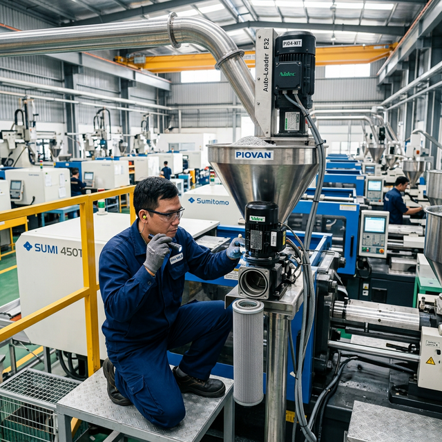

# Dịch vụ sửa máy hút liệu tự động – bảo dưỡng & sửa chữa chuyên nghiệp ngành nhựa

Máy hút liệu tự động dừng hoạt động đồng nghĩa với việc toàn bộ dây chuyền ép nhựa, thổi chai hay đùn màng đều phải ngừng theo. Mỗi giờ máy dừng, nhà máy mất đi hàng trăm kilogram sản phẩm và hàng triệu đồng chi phí cơ hội. Đây là lý do mà dịch vụ sửa chữa và bảo dưỡng máy hút liệu cần đảm bảo hai yếu tố: **nhanh** và **đúng kỹ thuật**.

Máy hút liệu (Auto Loader) là thiết bị phụ trợ then chốt trong mọi nhà máy nhựa, có nhiệm vụ hút hạt nhựa nguyên liệu từ bồn chứa và cấp liệu tự động vào phễu sấy hoặc trực tiếp vào máy ép nhựa. Khi thiết bị này gặp sự cố, toàn bộ chuỗi sản xuất bị ảnh hưởng ngay lập tức.

Trang này cung cấp đầy đủ thông tin về dịch vụ sửa chữa máy hút liệu tự động, hướng dẫn nhận biết các lỗi phổ biến, quy trình bảo dưỡng đúng chuẩn kỹ thuật, và giải pháp bảo trì định kỳ giúp máy vận hành ổn định lâu dài.

---

## Máy hút liệu tự động – cấu tạo và nguyên lý vận hành

Trước khi đi vào chi tiết dịch vụ sửa chữa, cần hiểu rõ cấu tạo và cách thức hoạt động của máy hút liệu. Kiến thức này giúp chủ nhà máy và kỹ sư bảo trì nhanh chóng xác định bộ phận gặp sự cố, từ đó rút ngắn thời gian chẩn đoán và sửa chữa.

### Các bộ phận chính của máy hút liệu

Một máy hút liệu tự động tiêu chuẩn gồm các bộ phận cốt lõi sau:

- **Động cơ (Motor)**: Tạo lực hút chân không, công suất phổ biến từ **0.37 kW** đến **7.5 kW** tùy model. Đây là "trái tim" của máy và cũng là bộ phận thường gặp sự cố nhất.
- **Quạt hút (Fan)**: Gắn trực tiếp trên trục động cơ, tạo dòng khí áp suất âm để hút nguyên liệu. Quạt thường làm bằng hợp kim nhôm hoặc thép chịu mài mòn.
- **Phễu chứa liệu (Hopper)**: Chế tạo từ **inox 304**, dung tích từ **3L đến 24L**, là nơi chứa tạm nguyên liệu trước khi cấp xuống máy chính.
- **Bộ lọc vải hoặc lưới lọc inox**: Ngăn bụi và tạp chất lọt vào động cơ, bảo vệ chất lượng nguyên liệu. Bộ lọc tắc nghẽn là nguyên nhân phổ biến nhất gây giảm lực hút.
- **Cảm biến báo liệu (Level Sensor)**: Tự động phát tín hiệu khi phễu đầy hoặc thiếu liệu. Cảm biến hỏng sẽ khiến máy hút liên tục hoặc không hút.
- **Board điều khiển và bộ hẹn giờ (Timer)**: Cài đặt chu kỳ hút – dừng – xả, cảnh báo lỗi hệ thống.
- **Ống dẫn liệu**: Kết nối bồn chứa nguyên liệu với phễu hút, đường kính phổ biến **Ø38 – 50 mm**.

### Phân loại máy hút liệu nhựa

Trên thị trường hiện có ba loại máy hút liệu chính, mỗi loại phù hợp với quy mô và yêu cầu sản xuất khác nhau:

| Loại máy | Đặc điểm | Phù hợp | Model tham khảo |
|---|---|---|---|
| **Loại 1 cục (Standalone)** | Motor gắn liền phễu, nhỏ gọn | Lắp trực tiếp trên máy ép nhựa | SAL-G, SAL-330 |
| **Loại 2 cục tách rời (Separated)** | Motor đặt riêng, ống dẫn nối phễu | Khoảng cách hút xa, giảm nhiễm bẩn nguyên liệu | HAL-300G, HAL-700G, WSAL-700G |
| **Loại trung tâm (Central Loader)** | 1 bơm hút trung tâm cấp cho nhiều máy | Nhà máy quy mô lớn, 10+ máy ép | Hệ thống SAL-UG |

Mỗi loại máy có đặc thù sửa chữa và bảo dưỡng riêng. Ví dụ, loại tách rời thường gặp vấn đề rò rỉ khí tại mối nối ống dẫn, trong khi loại standalone hay gặp tình trạng motor quá nhiệt do lắp trong không gian chật.

---

## Các lỗi thường gặp ở máy hút liệu và cách nhận biết

Trong quá trình vận hành liên tục tại nhà máy nhựa, máy hút liệu tự động sẽ phát sinh các lỗi kỹ thuật theo thời gian. Việc nhận biết sớm các dấu hiệu bất thường giúp xử lý kịp thời, tránh hư hỏng nặng hơn và giảm thiểu thời gian dừng máy.

### Lỗi về động cơ và quạt hút

Động cơ và quạt hút là hai bộ phận chịu tải nặng nhất trong máy hút liệu. Các triệu chứng cần chú ý:

- **Máy không khởi động được**: Kiểm tra nguồn điện, contactor, relay nhiệt. Nếu nguồn ổn định mà máy vẫn không chạy, khả năng cao cuộn dây motor đã cháy.
- **Motor quá nhiệt**: Vòng bi (bạc đạn) mòn gây ma sát lớn, hoặc máy hoạt động quá tải kéo dài mà không được nghỉ theo chu kỳ.
- **Tiếng kêu bất thường**: Vòng bi khô dầu, quạt hút bị vật liệu kẹt vào cánh, hoặc chổi than motor mòn không đều.
- **Rò rỉ dầu tại motor**: Phớt (oil seal) bị lão hóa, cần thay thế ngay để tránh dầu nhiễm vào nguyên liệu.
- **Điện năng tiêu thụ tăng bất thường**: Dấu hiệu cho thấy motor đang phải hoạt động gắng sức do hao mòn cơ khí hoặc tải quá lớn.

> Một motor máy hút liệu công suất **1.1 kW** hoạt động bình thường tiêu thụ khoảng **1.3 – 1.5 A** dòng điện. Nếu ampe kế chỉ vượt quá **2A**, cần dừng máy kiểm tra ngay trước khi motor cháy hoàn toàn.

### Lỗi về hệ thống ống dẫn và bộ lọc

Hệ thống ống dẫn và bộ lọc ảnh hưởng trực tiếp đến lực hút và chất lượng cấp liệu:

- **Lực hút yếu đi rõ rệt**: Nguyên nhân phổ biến nhất là bộ lọc vải bị bám bẩn dày đặc. Chỉ cần vệ sinh hoặc thay lọc mới, lực hút phục hồi ngay.
- **Hạt nhựa không lên phễu**: Ống dẫn bị tắc do vật liệu ẩm bám thành ống, hoặc ống bị gập gấp làm giảm tiết diện.
- **Rò rỉ khí tại mối nối ống**: Gioăng (gasket) tại điểm nối bị mòn hoặc lắp không khít, dẫn đến mất áp suất chân không và giảm hiệu năng hút.

### Lỗi về hệ thống điều khiển và cảm biến

Board điều khiển và cảm biến là "bộ não" của máy hút liệu tự động. Khi gặp lỗi, máy thường biểu hiện:

- **Máy hút liên tục không dừng**: Cảm biến báo đầy bị bám bụi nhựa, không nhận được tín hiệu → máy "nghĩ" phễu luôn thiếu liệu.
- **Máy không hút dù phễu trống**: Cảm biến bị lỗi hoặc dây tín hiệu đứt, board không nhận lệnh hút.
- **Chu kỳ hút – dừng không đều**: Timer hoặc relay bị lỗi, cần hiệu chỉnh hoặc thay mới.
- **Hỏng board điều khiển hoàn toàn**: Thường do sét đánh, nguồn điện không ổn định, hoặc ẩm lọt vào tủ điện.

### Bảng chẩn đoán nhanh – triệu chứng, nguyên nhân và giải pháp

| Triệu chứng | Nguyên nhân có thể | Giải pháp | Mức độ |
|---|---|---|---|
| Máy không khởi động | Cháy motor, hỏng contactor, mất pha | Kiểm tra điện + thay motor/contactor | Khẩn cấp |
| Motor quá nhiệt | Vòng bi mòn, quá tải | Thay vòng bi, kiểm tra tải | Khẩn cấp |
| Lực hút yếu | Bộ lọc bẩn, rò rỉ ống | Vệ sinh lọc, siết mối nối | Trung bình |
| Hạt nhựa không lên phễu | Tắc ống, ống gập | Thông ống, kiểm tra layout | Trung bình |
| Tiếng kêu bất thường | Vòng bi khô, cánh quạt kẹt | Tra dầu, vệ sinh quạt | Trung bình |
| Máy hút không tự dừng | Cảm biến bám bụi | Vệ sinh cảm biến | Đơn giản |
| Máy không hút dù phễu trống | Lỗi cảm biến, đứt dây | Thay cảm biến, nối dây | Trung bình |
| Chu kỳ hút không đều | Timer lỗi | Thay timer/relay | Trung bình |
| Board điều khiển chết | Quá áp, ẩm, sét | Thay board mới | Khẩn cấp |
| Điện năng tiêu thụ tăng | Motor hao mòn, lọc tắc | Kiểm tra tổng thể | Trung bình |

Bảng chẩn đoán trên giúp kỹ sư bảo trì và quản đốc sản xuất nhanh chóng định vị nguyên nhân, ưu tiên xử lý đúng thứ tự và quyết định có cần gọi kỹ thuật viên chuyên nghiệp hay không.

---

## Dịch vụ sửa chữa máy hút liệu tự động tại Trung Nguyên TNT

Với hơn **15 năm** kinh nghiệm trong ngành máy móc và tự động hóa nhựa, Trung Nguyên TNT cung cấp dịch vụ sửa chữa máy hút liệu toàn diện – từ xử lý sự cố khẩn cấp đến đại tu tổng thể cho các dòng máy đã vận hành nhiều năm.

### Sửa chữa khẩn cấp – xử lý trong ngày

Khi nhà máy gặp sự cố máy hút liệu đột ngột, mỗi phút đều quan trọng. Trung Nguyên TNT cam kết quy trình phản hồi nhanh **"Same-day support"**:

- Tiếp nhận yêu cầu qua hotline → Kỹ thuật viên tư vấn chẩn đoán sơ bộ qua điện thoại.
- Cử đội ngũ kỹ thuật đến xưởng khách hàng trong ngày tại khu vực TP.HCM và các tỉnh lân cận. Khu vực miền Bắc có chi nhánh Hải Dương hỗ trợ tương tự.
- Mang theo linh kiện thay thế phổ biến (motor, cảm biến, bộ lọc, timer), rút ngắn tối đa thời gian dừng máy.

Phạm vi sửa chữa khẩn cấp bao gồm: cháy motor, hỏng board điều khiển, quạt kẹt, ống tắc và các sự cố gây gián đoạn dây chuyền sản xuất.

### Sửa chữa tổng thể – đại tu máy

Với máy hút liệu đã sử dụng trên 3 – 5 năm, các bộ phận cùng lúc xuống cấp. Thay vì sửa vặt nhiều lần tốn kém, việc đại tu tổng thể giúp máy phục hồi gần như trạng thái ban đầu:

- Tháo rời toàn bộ máy → Kiểm tra từng bộ phận.
- Thay thế đồng loạt: vòng bi, phớt, dây curoa, bộ lọc, gioăng.
- Kiểm tra và hiệu chỉnh board điều khiển, cảm biến.
- Chạy thử tải → Đo dòng điện, kiểm tra lực hút → Bàn giao kèm bảo hành.

### Dịch vụ sửa máy hút nhựa – phạm vi xử lý

Trung Nguyên TNT nhận sửa chữa không giới hạn thương hiệu và model:

- **Dòng SAL (Standalone)**: SAL-G, SAL-U, SAL-UG, SAL-330/360.
- **Dòng HAL (Separated)**: HAL-300G, HAL-400G, HAL-700G, HAL-800G, HAL-1.5HP đến HAL-10HP.
- **Hệ thống hút liệu trung tâm**: Kiểm tra bơm trung tâm, van phân phối, đường ống.
- **Máy hút nhựa các hãng khác**: Shini, Matsui, và các thương hiệu phổ biến tại Việt Nam.

Đội ngũ kỹ thuật viên được đào tạo chuyên sâu, am hiểu cấu tạo từng dòng máy, đảm bảo chẩn đoán chính xác và sửa chữa đúng tiêu chuẩn kỹ thuật.

---

## Dịch vụ bảo dưỡng và bảo trì máy hút liệu định kỳ

Sửa chữa chỉ giải quyết phần "ngọn" – khi máy đã hỏng. Bảo dưỡng định kỳ mới là giải pháp "gốc" giúp phòng ngừa sự cố, kéo dài tuổi thọ thiết bị và duy trì năng suất sản xuất ổn định.

### Bảo dưỡng định kỳ theo chính sách 3-6-9-12 tháng

Trung Nguyên TNT áp dụng chính sách bảo dưỡng **3 – 6 – 9 – 12 tháng** trong năm đầu tiên sử dụng (miễn phí cho máy TNT cung cấp):

| Mốc thời gian | Nội dung bảo dưỡng |
|---|---|
| **Tháng thứ 3** | Vệ sinh bộ lọc, kiểm tra ống dẫn và mối nối, đo dòng điện motor |
| **Tháng thứ 6** | Kiểm tra và thay dây curoa (nếu mòn), bôi trơn vòng bi, vệ sinh cảm biến báo liệu |
| **Tháng thứ 9** | Vệ sinh sâu toàn bộ phễu và ống dẫn, kiểm tra board điều khiển, đo nhiệt độ motor |
| **Tháng thứ 12** | Đại tu nhẹ: thay phớt/gioăng, kiểm tra tổng thể, hiệu chỉnh timer và cảm biến |

Sau năm đầu tiên, doanh nghiệp có thể ký hợp đồng bảo trì hàng năm để duy trì chế độ bảo dưỡng chuyên nghiệp.

### Lợi ích bảo trì định kỳ – phòng bệnh hơn chữa bệnh

Số liệu thực tế từ các nhà máy nhựa cho thấy bảo trì định kỳ mang lại lợi ích kinh tế rõ rệt:

- **Giảm đến 70%** nguy cơ hỏng hóc bất ngờ gây dừng dây chuyền.
- **Tăng tuổi thọ bơm hút và motor lên 2 – 3 lần** so với máy không được bảo dưỡng.
- **Giảm tiêu hao điện năng**: Motor sạch, bộ lọc thông thoáng giúp máy hoạt động nhẹ nhàng hơn, tiết kiệm **10 – 15%** điện năng.
- **Duy trì chất lượng sản phẩm**: Bộ lọc sạch đảm bảo nguyên liệu không bị nhiễm bụi hoặc tạp chất.

> Với một nhà máy vận hành 10 máy hút liệu, chỉ cần 1 máy dừng đột ngột cũng kéo theo 1 máy ép nhựa phải ngừng sản xuất. Chi phí thiệt hại sản lượng trong 4 giờ dừng máy có thể tương đương chi phí bảo dưỡng cả năm. Đầu tư vào bảo trì dự phòng luôn là lựa chọn kinh tế hơn.

### So sánh chi phí: bảo dưỡng định kỳ và sửa chữa khẩn cấp

| Hạng mục | Bảo dưỡng định kỳ | Sửa chữa khẩn cấp |
|---|---|---|
| **Tần suất** | 4 lần/năm (theo lịch) | Phát sinh khi máy hỏng |
| **Chi phí trực tiếp** | Thấp – vệ sinh, thay tiêu hao | Cao – thay motor, board |
| **Thiệt hại gián tiếp** | Không – máy vẫn chạy | Rất cao – dừng dây chuyền |
| **Thời gian xử lý** | 1 – 2 giờ | 4 – 8 giờ (chờ linh kiện) |
| **Tuổi thọ máy** | Kéo dài 2 – 3 lần | Giảm do hỏng lặp lại |
| **Kết luận** | Tiết kiệm lâu dài | Tốn kém và rủi ro cao |

---

## Linh kiện thay thế máy hút liệu chính hãng

Một trong những yêu cầu quan trọng khi sửa chữa máy hút liệu là sử dụng linh kiện chính hãng. Linh kiện kém chất lượng có thể gây hỏng hóc lặp lại, thậm chí làm hỏng thêm các bộ phận khác.

### Danh sách linh kiện thay thế có sẵn tại kho Trung Nguyên TNT

| Linh kiện | Quy cách | Tình trạng kho |
|---|---|---|
| Motor các công suất | 0.37 – 1.1 – 2.2 – 5.5 – 7.5 kW | ✅ Sẵn hàng |
| Quạt hút | Hợp kim nhôm / thép | ✅ Sẵn hàng |
| Dây curoa | Các size phổ biến | ✅ Sẵn hàng |
| Bộ lọc vải / Lưới lọc inox | Theo model SAL, HAL | ✅ Sẵn hàng |
| Phễu inox 304 | 7.5L, 12L, 24L | ✅ Sẵn hàng |
| Cảm biến báo liệu | Microswitch, Proximity | ✅ Sẵn hàng |
| Board điều khiển / Timer | Theo dòng máy | ✅ Sẵn hàng |
| Phớt, gioăng, bulong khí | Bộ đầy đủ | ✅ Sẵn hàng |
| Ống dẫn liệu | Ø38 mm, Ø50 mm | ✅ Sẵn hàng |

Kho linh kiện chiến lược đặt tại **TP.HCM** (miền Nam) và **Hải Dương** (miền Bắc) đảm bảo giao hàng nhanh toàn quốc, rút ngắn thời gian chờ đợi khi cần thay thế khẩn cấp.

### Tại sao phải dùng linh kiện chính hãng

- **Tương thích 100%** với cấu tạo máy gốc, không phát sinh lỗi mới sau khi thay.
- **Bảo hành linh kiện** sau thay thế – khách hàng yên tâm vận hành.
- **Tuổi thọ cao hơn** so với hàng OEM trôi nổi trên thị trường, đặc biệt với các bộ phận chịu mài mòn như vòng bi, phớt, dây curoa.
- **Đội ngũ kỹ thuật TNT tư vấn đúng quy cách**, tránh tình trạng mua nhầm linh kiện không phù hợp.

---

## Quy trình dịch vụ sửa chữa và bảo dưỡng máy hút liệu

Trung Nguyên TNT vận hành quy trình dịch vụ chuẩn hóa gồm 5 bước, đảm bảo minh bạch và hiệu quả:

**Bước 1 – Tiếp nhận yêu cầu**: Khách hàng liên hệ qua hotline hoặc form trực tuyến. Kỹ thuật viên tiếp nhận thông tin: loại máy, model, triệu chứng lỗi, mức độ khẩn cấp.

**Bước 2 – Chẩn đoán tại xưởng**: Đội ngũ kỹ thuật đến trực tiếp nhà máy khách hàng. Kiểm tra thực tế, đo đạc thông số (dòng điện, nhiệt độ, lực hút), xác định chính xác nguyên nhân lỗi.

**Bước 3 – Báo giá minh bạch**: Liệt kê chi tiết từng hạng mục: linh kiện cần thay, chi phí nhân công, thời gian hoàn thành. Khách hàng duyệt báo giá trước khi tiến hành.

**Bước 4 – Sửa chữa hoặc bảo dưỡng**: Thực hiện theo đúng tiêu chuẩn kỹ thuật. Sử dụng linh kiện chính hãng. Ghi chép đầy đủ hạng mục đã thay thế và hiệu chỉnh.

**Bước 5 – Chạy thử và bàn giao**: Kiểm tra tổng thể sau sửa chữa: đo lại dòng điện, kiểm tra lực hút, chạy thử có tải. Bàn giao kèm phiếu bảo hành dịch vụ và hướng dẫn bảo quản.

Quy trình trên áp dụng cho cả dịch vụ sửa chữa lẫn bảo dưỡng định kỳ, giúp khách hàng nắm rõ từng bước và yên tâm về chất lượng dịch vụ.

---

## Vì sao chọn dịch vụ sửa máy hút liệu tại Trung Nguyên TNT

Thị trường hiện có nhiều đơn vị nhận sửa chữa thiết bị công nghiệp, nhưng rất ít đơn vị chuyên sâu về máy hút liệu nhựa. Việc chọn đúng đơn vị kỹ thuật quyết định máy được sửa **đúng** và **bền** hay chỉ sửa cho "qua ngày" rồi hỏng lại.

**Chuyên môn sâu ngành nhựa**: Trung Nguyên TNT không phải đơn vị sửa chữa tổng hợp. Chúng tôi chuyên về máy móc và thiết bị phụ trợ ngành nhựa – từ máy ép nhựa, máy thổi chai, máy băm, máy sấy đến máy hút liệu. Kỹ thuật viên hiểu rõ từng dòng máy, từng bộ phận.

**15 năm kinh nghiệm tích lũy**: Khởi đầu từ 2013 tại môi trường quốc tế, chính thức mang công nghệ về Việt Nam từ 2018. Đội ngũ kỹ thuật được đào tạo bài bản theo tiêu chuẩn kỹ thuật Đài Loan.

**Hạ tầng và tốc độ**: Kho linh kiện chiến lược tại **TP.HCM** và **Hải Dương**, luôn sẵn motor, cảm biến, board và phụ tùng tiêu hao. Cam kết xử lý sự cố trong ngày.

**Chính sách bảo dưỡng vượt trội**: Bảo dưỡng miễn phí **3 – 6 – 9 – 12 tháng** trong năm đầu cho máy TNT cung cấp. Hỗ trợ kỹ thuật trọn đời cho tất cả dòng máy.

**Kinh tế và minh bạch**: Báo giá chi tiết trước khi sửa. Không phát sinh chi phí ngoài phạm vi đã thống nhất. Bảo hành sau dịch vụ rõ ràng.

---

## Câu hỏi thường gặp về sửa chữa và bảo dưỡng máy hút liệu

### Máy hút liệu bị mất lực hút – nguyên nhân và cách xử lý?

Nguyên nhân phổ biến nhất là bộ lọc vải bị bám bẩn, tiếp đến là rò rỉ khí tại mối nối ống dẫn. Cách xử lý: Tháo bộ lọc ra vệ sinh hoặc thay mới, kiểm tra siết chặt các mối nối. Nếu vẫn không cải thiện, cần kiểm tra quạt hút và motor.

### Chi phí sửa chữa máy hút liệu tự động khoảng bao nhiêu?

Chi phí phụ thuộc vào mức độ hư hỏng. Các lỗi đơn giản như thay bộ lọc, vệ sinh cảm biến có chi phí thấp. Thay motor hoặc board điều khiển sẽ có chi phí cao hơn. Trung Nguyên TNT luôn báo giá chi tiết và minh bạch trước khi tiến hành sửa chữa.

### Bao lâu nên bảo dưỡng máy hút liệu một lần?

Khuyến nghị tối thiểu **mỗi 3 tháng** cho các hạng mục cơ bản (vệ sinh lọc, kiểm tra ống). Đại tu nhẹ nên thực hiện **mỗi 12 tháng**. Với máy hoạt động cường độ cao (3 ca/ngày), chu kỳ bảo dưỡng cần rút ngắn hơn.

### Có nên tự sửa máy hút liệu hay gọi kỹ thuật viên?

Các lỗi mức độ đơn giản (vệ sinh lọc, cảm biến) có thể tự xử lý nếu có kiến thức cơ bản. Với lỗi trung bình và khẩn cấp (motor, board, quạt), nên gọi kỹ thuật viên chuyên nghiệp để tránh sửa sai gây hỏng thêm và mất an toàn điện.

### Máy hút liệu cũ – nên sửa hay thay mới?

Nguyên tắc chung: Nếu chi phí sửa chữa vượt quá **50 – 60%** giá máy mới, nên cân nhắc đầu tư máy mới. Tuy nhiên, nhiều trường hợp chỉ cần đại tu motor và thay linh kiện hao mòn, máy hoàn toàn có thể hoạt động thêm 3 – 5 năm nữa với chi phí hợp lý hơn nhiều so với mua mới.

---

## Liên hệ dịch vụ sửa chữa và bảo dưỡng máy hút liệu

Đừng để máy hút liệu hỏng kéo theo thiệt hại cho cả dây chuyền sản xuất. Liên hệ ngay với **Trung Nguyên TNT** để được tư vấn và hỗ trợ kỹ thuật nhanh nhất.

**Trung Nguyên TNT – Công ty TNHH Trung Nguyên TNT**
- **Chi nhánh miền Nam**: TP. Hồ Chí Minh
- **Chi nhánh miền Bắc**: Hải Dương
- **Hỗ trợ kỹ thuật**: Trọn đời cho các dòng máy TNT cung cấp
- **Chính sách**: Bảo dưỡng miễn phí 3-6-9-12 tháng năm đầu tiên

*Trung Nguyên TNT – "Bền bỉ - Hiệu quả - Tối ưu" – 15 năm đồng hành cùng ngành nhựa Việt Nam.*
