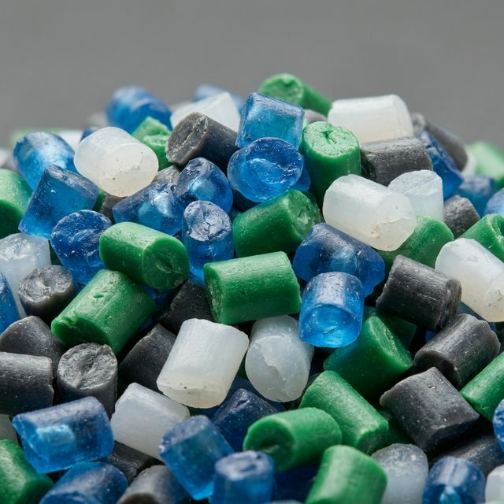
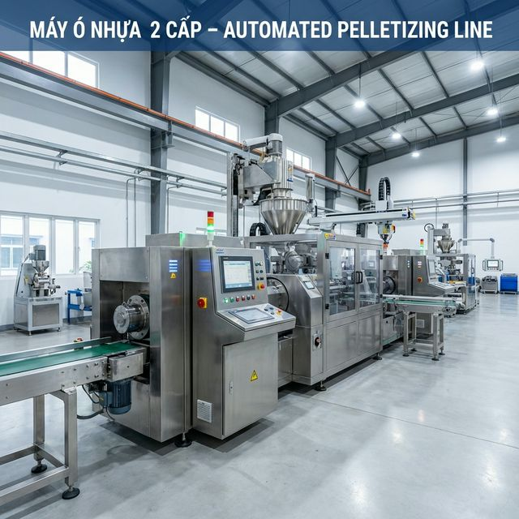

# Hướng dẫn mở xưởng sản xuất hạt nhựa: Quy trình pháp lý và hệ thống phụ trợ tự động hóa 2026

Khởi nghiệp trong ngành nhựa, đặc biệt là mảng sản xuất hạt nhựa tái sinh (nhựa ó), đang trở thành hướng đi đầy tiềm năng tại Việt Nam khi nền kinh tế chuyển dịch mạnh mẽ sang mô hình kinh tế tuần hoàn. Tuy nhiên, để một xưởng sản xuất vận hành trơn tru, mang lại lợi nhuận thực tế chứ không chỉ dừng lại ở quy mô tự phát, doanh nghiệp cần một lộ trình kỹ thuật và pháp lý bài bản.

Dưới đây là cẩm nang chi tiết từ góc nhìn kỹ thuật của đội ngũ **Trung Nguyên TNT** – đơn vị với 15 năm kinh nghiệm trong chuyển giao công nghệ tự động hóa và thiết bị phụ trợ ngành nhựa tiêu chuẩn Đài Loan.

## 1. Phân tích tiềm năng thị trường hạt nhựa tái sinh 2026

Ngành nhựa Việt Nam đang đứng trước làn sóng tự động hóa mạnh mẽ. Nhu cầu hạt nhựa tái sinh (HDPE, PP, PE, PVC, ABS) không còn chỉ dừng lại ở các mặt hàng gia dụng giá rẻ, mà đã len lỏi sâu vào chuỗi cung ứng linh kiện kỹ thuật, vỏ thiết bị điện tử và bao bì xuất khẩu. 

### Xu hướng kinh tế tuần hoàn và cơ hội cho doanh nghiệp nội
Theo dự báo từ Hiệp hội Nhựa Việt Nam (VPA), tỷ lệ sử dụng nhựa tái chế trong sản phẩm công nghiệp sẽ tăng thêm 15-20% vào năm 2029 để đáp ứng các tiêu chuẩn xuất khẩu khắt khe như Cơ chế điều chỉnh biên giới carbon (CBAM) của EU. Điều này mở ra cơ hội khổng lồ cho các xưởng sản xuất có khả năng cung ứng hạt nhựa đạt chuẩn "Green Grade" – tức là hạt có độ tinh khiết cao, tính chất vật lý ổn định.

Việc mở xưởng sản xuất hạt nhựa tái sinh không chỉ là câu chuyện thu gom phế liệu. Đó là quá trình nâng cấp giá trị tài nguyên. Hạt nhựa PP tái sinh chất lượng cao có thể có giá bán chênh lệch từ 3.000 - 5.000đ/kg so với nhựa tái chế thô lỗi thời. Với một xưởng công suất 300 tấn/tháng, biên lợi nhuận này chính là chìa khóa để doanh nghiệp tái đầu tư vào hệ thống tự động hóa.

### Phân tích dòng nguyên liệu: HDPE vs PP vs PE
Mỗi loại nhựa đòi hỏi một quy trình gia nhiệt và hệ thống lọc khác nhau:
*   **Nhựa HDPE (High-Density Polyethylene)**: Thường lấy từ chai dầu gội, can nhựa. Đặc điểm là độ bền cao, nhưng dễ bị lẫn mùi. Quy trình cần hệ thống khử mùi chuyên sâu.
*   **Nhựa PP (Polypropylene)**: Lấy từ bao bì, hộp thực phẩm. Nhựa này có độ bóng cao nhưng dải nhiệt độ nóng chảy hẹp, yêu cầu máy ó phải kiểm soát nhiệt độ cực kỳ chính xác qua hệ thống đồng hồ nhiệt PID.
*   **Nhựa PE (Polyethylene)**: Màng bọc, túi nilon. Dòng nhựa này nhẹ, dễ bị cuốn vào trục vít gây tắc nghẽn, bắt buộc phải có hệ thống Force Feeder (nạp liệu cưỡng bức).

> **Lời khuyên kỹ sư**: Trước khi đầu tư, chủ xưởng cần xác định rõ nguồn liệu đầu vào. Nhựa tái sinh từ màng (Film) đòi hỏi máy ó nhựa có hệ thống nạp liệu cưỡng bức (Force Feeder), trong khi nhựa cứng (Crates/Bins) cần hệ thống băm nghiền mạnh mẽ để đảm bảo công suất đầu ra ổn định. Việc chọn đúng cấu hình máy ngay từ đầu là yếu tố sống còn để tối ưu hóa chi phí sản xuất.

## 2. Lộ trình pháp lý: Những cột mốc không thể bỏ qua

Sản xuất nhựa là ngành có tác động trực tiếp đến môi trường. Việc tuân thủ pháp lý không chỉ để tránh bị phạt mà còn là điều kiện tiên quyết để tham gia vào chuỗi cung ứng của các tập đoàn lớn:

### 2.1. Thành lập doanh nghiệp và mã ngành hoạt động
Chủ đầu tư nên đăng ký loại hình Công ty TNHH để tối ưu hóa trách nhiệm hữu hạn và dễ dàng thực hiện các giao dịch vay vốn ngân hàng cho dự án máy móc. 
*   **Mã ngành chính**: 2220 (Sản xuất sản phẩm từ plastic).
*   **Mã ngành phụ**: 3830 (Tái chế phế liệu) – cực kỳ quan trọng nếu xưởng có khâu thu mua phế liệu trực tiếp từ dân cư hoặc vựa ve chai.

### 2.2. Giấy phép môi trường và Đánh giá tác động (DTM)
Đây là rào cản lớn nhất khiến nhiều chủ xưởng "bỏ cuộc" giữa chừng. Theo Luật Bảo vệ môi trường 2024, các dự án sản xuất hạt nhựa tái sinh thuộc nhóm có nguy cơ gây ô nhiễm cao. 
*   **Hệ thống xử lý khí thải**: Quá trình gia nhiệt nhựa phát sinh khí VOC (Hợp chất hữu cơ dễ bay hơi) và mùi khét đặc trưng. Bạn bắt buộc phải lắp đặt tháp hấp thụ bằng than hoạt tính và hệ thống hút mùi tại máy đùn.
*   **Xử lý nước thải**: Nước từ các bể rửa phế liệu chứa nhiều bùn đất và hóa chất tẩy rửa. Hệ thống xử lý nước thải phải đạt cột B theo quy chuẩn kỹ thuật quốc gia trước khi xả thải.

### 2.3. Chứng nhận PCCC và An toàn lao động
Kho chứa nhựa là "mồi ngon" cho lửa. 
*   **Thiết kế xưởng**: Kho nguyên liệu, khu vực sản xuất và kho thành phẩm phải được ngăn cách bằng tường chống cháy.
*   **Hệ thống đầu phun (Sprinkler)**: Phải được thẩm duyệt bản vẽ bởi cơ quan công an PCCC cấp tỉnh/thành phố. Việc sai lệch bản vẽ khi xây dựng sẽ dẫn đến việc không thể nghiệm thu và không được phép vận hành máy móc.

## 3. Hệ thống máy móc cần thiết để mở xưởng sản xuất hạt nhựa

Để một xưởng sản xuất hạt nhựa vận hành khép kín và đạt tiêu chuẩn xuất khẩu, chủ đầu tư cần trang bị một danh mục máy móc đồng bộ. Việc thiếu hụt bất kỳ mắt xích nào cũng sẽ làm giảm chất lượng hạt nhựa thành phẩm (bị bọt khí, độ bóng kém hoặc lẫn tạp chất).

### A. Dây chuyền sản xuất chính (Main Production Line)
Đây là các thiết bị trực tiếp tham gia vào quá trình biến đổi phế liệu thành hạt nhựa:
1.  **Hệ thống băm, nghiền nhựa**: Phá vỡ phế liệu nhựa (bao bì, chai lọ, Pallet...) thành các hạt nhỏ (liệu băm). Một hệ thống băm chuẩn cần có bộ dao chất lượng (như dao thép SKD11) để duy trì độ sắc bén, tránh làm nhựa bị nát vụn hoặc sinh nhiệt quá cao trong lúc băm. Nếu dao băm bị cùn, nhựa sẽ bị dập nhiều hơn là cắt, tạo ra nhiều bụi nhựa gây hao hụt nguyên liệu (yield loss).
2.  **Hệ thống rửa và sấy khô**: Là công đoạn quyết định độ tinh khiết của nhựa. Phế liệu sau băm sẽ được đưa qua bể rửa nước lạnh, bể rửa hóa chất (nếu cần) và máy sấy ly tâm. Nếu độ ẩm của liệu băm trên 5%, khi vào máy ó sẽ gây hiện tượng bọt khí trong hạt nhựa, làm giảm khối lượng riêng và độ bền kéo của hạt.
3.  **Máy ó hạt nhựa (Máy tạo hạt)**: Thiết bị gia nhiệt nung chảy nhựa và đùn ra thành sợi qua lưới lọc tạp chất. 
    *   **Máy ó 2 cấp (Double Stage)**: Đây là lựa chọn vàng cho nhựa tái chế. Cấp 1 giúp lọc các tạp chất lớn (giấy, kim loại lọt vào), cấp 2 giúp hóa dẻo sâu và lọc tinh chất bằng lưới lọc dày hơn (mesh cao hơn). Việc chia làm 2 cấp giúp giảm áp lực lên trục vít và nòng máy, kéo dài tuổi thọ thiết bị.
4.  **Hệ thống cắt hạt**: Cắt sợi nhựa sau khi làm lạnh thành các hạt nhựa đồng nhất. Có 2 dạng cắt phổ biến: 
    *   **Cắt mặt đầu (khô)**: Phù hợp cho nhựa có độ cứng cao như ABS, PC.
    *   **Cắt sợi (ướt)**: Phổ biến nhất cho PP, PE, nhựa mềm. Sợi nhựa đi qua bể nước làm lạnh rồi mới được đưa vào dao cắt.

### B. Hệ thống phụ trợ & Tự động hóa (Auxiliary & Automation - Thế mạnh của TNT)
Đây là "hệ điều hành" giúp dây chuyền chính đạt hiệu suất tối đa, tiết kiệm điện và giảm nhân công:
1.  **Máy băm nhựa dạng dao phiến TNT**: Giúp hạt băm đồng đều, bảo vệ trục vít máy ó. Với thiết kế tối ưu, máy băm của chúng tôi giảm tiếng ồn và bụi nhựa tới 30% so với các dòng máy phổ thông. Độ hở giữa dao tĩnh và dao động được căn chỉnh chính xác đến từng micron, đảm bảo vết cắt ngọt, không làm "dập" cấu trúc polymer của nhựa.
2.  **Hệ thống Chiller giải nhiệt TNT**: Sợi nhựa sau khi đùn ra từ máy ó có nhiệt độ rất cao (180 - 230 độ C). Nếu không được làm lạnh nhanh và chuẩn xác trong bể nước, sợi nhựa sẽ bị dãn hoặc biến dạng. Hệ thống Chiller của TNT duy trì nhiệt độ nước bể ở mức 15-20 độ C ổn định, giúp hạt nhựa sau khi cắt bị có độ bóng cao, mật độ đặc.
3.  **Cánh tay Robot 5 trục**: Ứng dụng công nghệ Servo giúp tự động hóa khâu gắp thành phẩm, đóng bao và xếp pallet. Trong môi trường nóng bức và bụi bặm của xưởng nhựa, Robot là giải pháp lý tưởng để bảo vệ sức khỏe người lao động và duy trì chu kỳ sản xuất ổn định tuyệt đối 24/7.
4.  **Máy sấy nhựa (Hopper Dryer)**: Dùng để sấy hạt nhựa sau cắt (nếu cắt sợi ướt) hoặc sấy liệu băm trước khi vào máy ó. Hạt nhựa bị ẩm khi đưa vào máy ép phun sẽ gây ra các vết sọc hoặc rỗ bề mặt sản phẩm thành phẩm.
5.  **Máy trộn nhựa (Mixer)**: Một xưởng nhựa chuyên nghiệp luôn cần máy trộn để đồng nhất màu sắc và tính chất giữa các lô hàng khác nhau. Máy trộn đứng của TNT có cánh khuấy thiết kế khí động học, giúp trộn đều hàng tấn nhựa chỉ trong vài phút.

## 4. Giải pháp hệ thống: "Engine of Efficiency" từ Trung Nguyên TNT

Tại **Trung Nguyên TNT**, chúng tôi không trực tiếp cung cấp máy ó (pelletizer). Tuy nhiên, chúng tôi là đối tác cung cấp toàn bộ **Hệ thống thiết bị phụ trợ & Tự động hóa (Mục B)** nêu trên. Chúng tôi coi mình là đơn vị **System Integrator** – người lắp ghép những mảnh ghép rời rạc thành một cỗ máy sản xuất in tiền.

### 4.1. Tư duy "Total Cost of Ownership" (TCO) trong sản xuất nhựa
Nhiều chủ xưởng khi setup lần đầu thường chỉ nhìn vào giá mua máy (Investment Cost). Nhưng tại TNT, chúng tôi yêu cầu khách hàng nhìn vào **TCO**. Một hệ thống phụ trợ chất lượng từ TNT có thể có giá cao hơn máy cũ 20%, nhưng sẽ mang lại lợi ích khổng lồ:
*   **Điện năng**: Một máy băm hiệu suất kém hoặc một bộ Chiller đời cũ sẽ ngốn thêm 15-20% điện năng. Trong vòng 5 năm, số tiền điện dư thừa này đủ để bạn mua mới hoàn toàn một dàn thiết bị phụ trợ cao cấp.
*   **Chi phí dừng máy (Downtime)**: Mỗi giờ dừng máy ó do hỏng bơm nước giải nhiệt hoặc hỏng dao băm có thể khiến bạn thiệt hại hàng chục triệu đồng tiền sản lượng và lãng phí một lượng điện gia nhiệt cực lớn.

### 4.2. Chi tiết các giải pháp "Zero-Fluff" từ TNT

#### A. Tối ưu hóa nguyên liệu đầu vào (Máy băm & nghiền)
Phế liệu nhựa cần được xử lý chuẩn trước khi đưa vào máy ó. **Trung Nguyên TNT** cung cấp dòng máy băm với lưỡi dao tiêu chuẩn Đài Loan (60HRC).
*   **Hiệu quả**: Hạt băm sạch bụi, giúp tiêu chuẩn hóa liệu đầu vào, giảm mài mòn trục vít máy ó. Khi liệu vào máy ó đồng nhất, áp suất trong nòng máy sẽ ổn định, giúp hạt nhựa đùn ra có chất lượng đồng nhất từ đầu đến cuối lô. Điều này cực kỳ quan trọng nếu bạn muốn bán hàng cho các nhà máy sản xuất linh kiện điện tử hoặc ô tô.

#### B. Tối ưu hóa vận hành & Đóng gói (Industrial Robots)
Thay vì dùng 2 nhân công đứng đóng bao thủ công – một công việc lặp đi lặp lại và dễ gây mệt mỏi dẫn đến nhầm lẫn trọng lượng – việc ứng dụng **Cánh tay Robot 5 trục** từ TNT giúp:
*   **Lợi ích**: Chu kỳ đóng gói chuẩn xác 100%, hoạt động bền bỉ 24/7. Robot của TNT được trang bị hệ thống điều khiển PLC thông minh, dễ dàng lập trình lại khi bạn thay đổi kích thước bao đóng gói. Điều này giúp xưởng của bạn trông chuyên nghiệp hơn hẳn trong mắt các đối tác nước ngoài khi đến Audit nhà xưởng.

#### C. Hệ thống giải nhiệt & Sấy khô (Advanced Chillers & Dehumidifying Dryers)
Hạt nhựa sau khi ó cần được làm lạnh nhanh để định hình cấu trúc tinh thể polymer. Nếu nhiệt độ nước không ổn định, hạt nhựa sẽ bị bọt hoặc bị giòn do sốc nhiệt.
*   **Chiller giải nhiệt TNT**: Chúng tôi sử dụng lốc máy nén (Compressor) từ các thương hiệu hàng đầu Nhật Bản như Daikin hoặc Panasonic, kết hợp với dàn ngưng tụ (Condenser) hiệu suất cao. Hệ thống điều khiển nhiệt độ thông minh giúp duy trì sai số chỉ trong khoảng +/- 1 độ C.
*   **Phễu sấy nhựa (Hopper Dryer) & Máy sấy tách ẩm**: Đối với các dòng nhựa kỹ thuật cao cấp, TNT cung cấp hệ thống sấy tách ẩm (Honeycomb Dehumidifier) giúp loại bỏ triệt để hơi ẩm trong hạt nhựa xuống dưới mức 0.02%. Điều này ngăn chặn hoàn toàn hiện tượng thủy phân nhựa khi khách hàng của bạn đưa hạt nhựa vào máy ép phun.

> **Góc nhìn kỹ thuật**: Việc thiếu hệ thống Chiller giải nhiệt chuẩn sẽ khiến hạt nhựa bị "bở", cấu trúc không vững chắc, làm giảm giá bán thành phẩm từ 5-10%. Đặc biệt với nhựa PVC tái sinh, nếu không được làm lạnh đúng cách, nhựa sẽ tiếp tục quá trình phân hủy nhiệt ngay cả khi đã đóng bao, gây hỏng toàn bộ lô hàng. Chiller của TNT được thiết kế với dàn bay hơi chống ăn mòn (anti-corrosion), phù hợp cho cả môi trường xưởng nhựa có hóa chất.

### 4.3. Quy trình Set-up xưởng nhựa tiêu chuẩn Trung Nguyên TNT
Tại TNT, chúng tôi không chỉ giao máy rồi thu tiền. Quy trình của chúng tôi bao gồm:
1.  **Khảo sát mặt bằng**: Kỹ sư TNT sẽ xuống tận nơi để đo đạc, tính toán hướng gió và vị trí đặt các thiết bị phụ trợ sao cho tối ưu hóa đường ống nước và cáp điện.
2.  **Thiết kế Layout 2D/3D**: Bạn sẽ nhận được bản vẽ bố trí máy móc khoa học, giúp giảm quãng đường di chuyển của liệu, từ đó giảm tối đa bụi nhựa và tiếng ồn trong xưởng.
3.  **Tích hợp hệ thống**: Kết nối dữ liệu giữa máy ó chính và các thiết bị phụ trợ TNT. Khi máy ó gặp sự cố, hệ thống Robot và băng tải của TNT sẽ tự động đưa ra cảnh báo hoặc dừng an toàn để tránh lãng phí nhiên liệu.

## 5. Dự toán đầu tư & Bài toán ROI (Return on Investment) - Chiến lược 2026

Bảng chi phí tham khảo cho hệ thống phụ trợ & tự động hóa tại xưởng hạt nhựa (công suất 300-500kg/h). Lưu ý, đây là ngân sách cho thiết bị chất lượng cao, giúp bạn vận hành bền bỉ trên 10 năm:

| Hạng mục đầu tư | Ngân sách ước tính (VND) | Vai trò của Trung Nguyên TNT |
| :--- | :--- | :--- |
| Máy ó nhựa 2 cấp (Thương hiệu khác) | 1.8 - 2.5 tỷ | Tư vấn chọn cấu hình & Lắp đặt tích hợp. |
| Hệ máy băm, rửa, sấy TNT | 600 - 900 triệu | Cung cấp thiết bị & Bàn giao kỹ thuật. |
| Hệ thống Chiller giải nhiệt TNT | 150 - 300 triệu | Thiết kế hệ thống làm mát đồng bộ. |
| Robot đóng bao & Tự động hóa TNT | 300 - 500 triệu | Giải pháp giảm thiểu nhân công thủ công. |

### 5.1. Phân tích điểm hòa vốn
Với giá điện công nghiệp và chi phí nhân công ngày càng tăng, mô hình xưởng nhựa truyền thống (dùng máy cũ, nhiều lao động) đang dần bị đào thải. 
*   **Tiền điện**: Tiết kiệm 30% điện năng mỗi tháng (khoảng 15-25 triệu đồng cho xưởng trung bình).
*   **Nhân sự**: Cánh tay Robot thay thế 2-3 lao động phổ thông. Với mức lương 10 triệu/người, bạn tiết kiệm được 360 triệu/năm.
*   **Sản lượng**: Tăng thêm 10% nhờ giảm Downtime.

**Tổng kết ROI**: Một xưởng nhựa setup chuẩn theo giải pháp của **Trung Nguyên TNT** thường có thời gian thu hồi vốn nhanh hơn 12 tháng so với mô hình cũ.

---

## 6. Những rủi ro thường gặp và cách khắc phục

Mở xưởng nhựa không phải là "thảm đỏ". Bạn sẽ đối mặt với những thách thức sau:

1.  **Rủi ro nguyên liệu**: Nguồn liệu đầu vào không đều hoặc bị trộn lẫn rác.
    *   *Khắc phục*: Cần xây dựng mối quan hệ bền vững với các vựa ve chai hoặc nhập khẩu phế liệu nhựa (cần giấy phép nhập khẩu).
2.  **Rủi ro kỹ thuật**: Gãy trục vít hoặc hỏng lưới lọc đột ngột.
    *   *Khắc phục*: Luôn có sẵn phụ tùng thay thế và sử dụng hệ thống giám sát tải trọng động cơ từ TNT để phát hiện sớm các bất thường.
3.  **Rủi ro thị trường**: Giá nhựa nguyên sinh sụt giảm mạnh khiến hạt nhựa tái sinh mất giá cạnh tranh.
    *   *Khắc phục*: Tập trung vào chất lượng hạt nhựa cao cấp để bán cho các đơn vị làm hàng linh kiện, hàng xuất khẩu thay vì chỉ làm nhựa rẻ tiền.

## 7. Trung Nguyên TNT: Đối tác chiến lược cho sự thịnh vượng bền vững

Với hạ tầng kho xác và linh kiện lớn nhất tại **TP.HCM và Hải Dương**, đội ngũ kỹ thuật của **Trung Nguyên TNT** không chỉ là nhà cung cấp thiết bị, chúng tôi là **cánh tay nối dài cho đội ngũ kỹ thuật của bạn**:

### 7.1. Dịch vụ kỹ thuật "Phản ứng nhanh" (Rapid Response)
Ngành nhựa là ngành sản xuất liên tục 24/7. Mỗi phút dừng máy là một phút mất tiền. Hiểu được điều đó, TNT xây dựng mạng lưới hỗ trợ kỹ thuật:
*   **Hotline Kỹ thuật 24/7**: Luôn có kỹ sư trực máy để hướng dẫn xử lý các sự cố vận hành cơ bản qua video call.
*   **Có mặt trong 12h-24h**: Đối với các sự cố phức tạp, đội ngũ kỹ thuật lưu động của TNT cam kết có mặt tại xưởng của bạn trong thời gian nhanh nhất để khắc phục, đảm bảo dây chuyền không bị gián đoạn quá lâu.

### 7.2. Đào tạo và Chuyển giao quy trình (Know-how Transfer)
Chúng tôi không chỉ lắp máy, chúng tôi đào tạo công nhân của bạn trở thành những kỹ thuật viên vận hành máy chuyên nghiệp:
*   **Hướng dẫn bảo trì dự phòng (Preventive Maintenance)**: Đào tạo công nhân cách vệ sinh lưới lọc của Chiller, cách kiểm tra độ mòn của dao băm và cách lập trình lại Robot.
*   **Bàn giao bộ tài liệu vận hành**: Mỗi máy móc từ TNT đều đi kèm sổ tay hướng dẫn chi tiết bằng tiếng Việt, giúp người vận hành dễ dàng làm chủ công nghệ.

### 7.3. Cam kết đồng hành 3-6-9-12
Chính sách hậu mãi của TNT là chìa khóa tạo nên sự khác biệt:
*   **Miễn phí bảo dưỡng định kỳ**: Trong năm đầu tiên, cứ mỗi 3 tháng, kỹ sư TNT sẽ chủ động xuống xưởng kiểm tra tổng thể hệ thống, tra dầu mỡ và căn chỉnh các thông số kỹ thuật cho bạn.
*   **Kho linh kiện sẵn có**: Chúng tôi luôn dự phòng đầy đủ các linh kiện tiêu dùng nhanh (như dao băm, phớt máy nén, cảm biến nhiệt...) để thay thế ngay lập tức khi cần, bạn không phải đợi nhập hàng từ nước ngoài.

Đừng để hệ thống phụ trợ lạc hậu làm giảm hiệu suất của máy chính và bào mòn lợi nhuận của bạn. Hãy liên hệ với **Trung Nguyên TNT** ngay hôm nay để được tư vấn thiết lập một xưởng sản xuất hạt nhựa mang tầm vóc quốc tế, tối ưu hóa lợi nhuận và bền bỉ cùng thời gian. Chúng tôi không hứa cho bạn cái máy giá rẻ nhất, nhưng chúng tôi cam kết mang lại giải pháp sinh lời ổn định và bền vững nhất cho sự nghiệp của bạn.

---
**TRUNG NGUYÊN TNT – TIÊU CHUẨN CÔNG NGHỆ TỰ ĐỘNG HÓA NGÀNH NHỰA**
*   **Tổng kho Miền Nam**: Quận Bình Tân, TP. Hồ Chí Minh.
*   **Tổng kho Miền Bắc**: Hải Dương.
*   **Hotline Kỹ thuật**: [Cập nhật Số điện thoại]
*   **Website**: trungnguyentnt.vn
