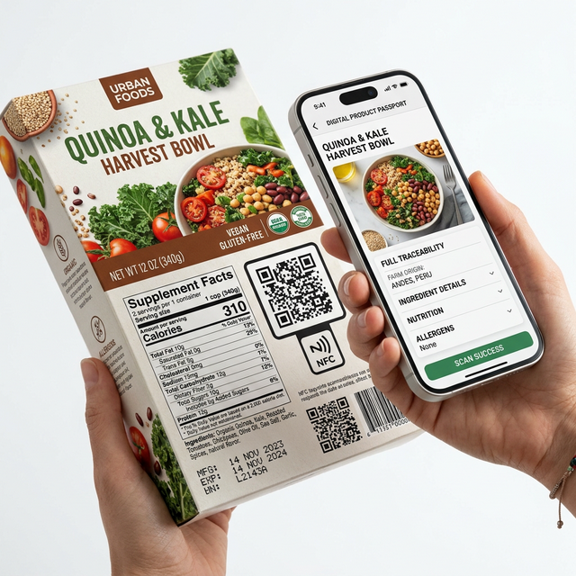
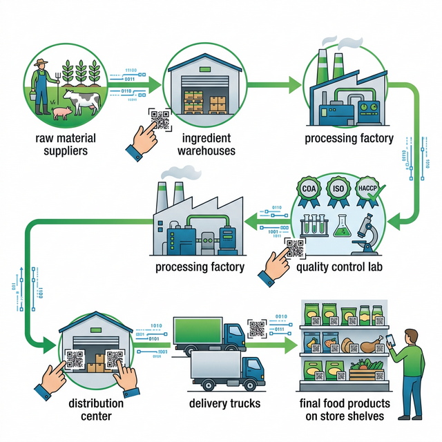

# Nghị định 37/2026/NĐ-CP về an toàn thực phẩm – Tổng hợp điểm mới và hướng dẫn tuân thủ cho doanh nghiệp F&B

Kể từ ngày 23/01/2026, **Nghị định 37/2026/NĐ-CP** chính thức có hiệu lực, thay thế Nghị định 43/2017/NĐ-CP – văn bản đã chi phối cách doanh nghiệp ghi nhãn hàng hóa suốt gần 9 năm. Sự thay đổi này không chỉ dừng ở việc "cập nhật nhãn sản phẩm".

Nghị định 37/2026/NĐ-CP quy định chi tiết thi hành **Luật Chất lượng sản phẩm, hàng hóa** (Luật 05/2007/QH12, sửa đổi bởi Luật 78/2025/QH15). Phạm vi điều chỉnh bao gồm: ghi nhãn hàng hóa, mã số mã vạch, **truy xuất nguồn gốc**, **hộ chiếu số sản phẩm**, đánh giá sự phù hợp và phân loại mức độ rủi ro.

Đối với ngành thực phẩm và F&B, đây là một trong những thay đổi pháp lý lớn nhất trong năm 2026. Bài viết này tổng hợp **5 điểm mới then chốt** và hướng dẫn tuân thủ dành riêng cho doanh nghiệp sản xuất, kinh doanh thực phẩm.

| Thông tin | Chi tiết |
|-----------|----------|
| **Số hiệu** | 37/2026/NĐ-CP |
| **Ngày ban hành** | 23/01/2026 |
| **Hiệu lực** | Từ ngày 23/01/2026 |
| **Cơ quan ban hành** | Chính phủ |
| **Thay thế** | NĐ 43/2017/NĐ-CP, NĐ 111/2021/NĐ-CP, NĐ 86/2021/NĐ-CP |
| **Phạm vi** | Chất lượng SPHH, nhãn, TXNG, hộ chiếu số, đánh giá sự phù hợp |

---

## Nghị định 37/2026/NĐ-CP là gì? Phạm vi điều chỉnh và đối tượng áp dụng

Nghị định 37/2026/NĐ-CP là văn bản hướng dẫn chi tiết **Luật Chất lượng sản phẩm, hàng hóa** (số 05/2007/QH12, đã được sửa đổi bổ sung bởi Luật số 78/2025/QH15). Nghị định này do Phó Thủ tướng Chính phủ ký ban hành ngày 23/01/2026 và có hiệu lực ngay cùng ngày.

### Phạm vi điều chỉnh – 6 lĩnh vực trọng tâm

Nghị định quy định chi tiết các nội dung thuộc 6 lĩnh vực chính:

- **Nhãn hàng hóa**: Vị trí, nội dung bắt buộc, nhãn điện tử
- **Mã số, mã vạch**: Quản lý và ứng dụng mã vạch sản phẩm
- **Truy xuất nguồn gốc**: Yêu cầu bắt buộc, hệ thống dữ liệu quốc gia
- **Hộ chiếu số sản phẩm**: Dữ liệu điện tử gắn mã định danh
- **Đánh giá sự phù hợp**: Quy trình kiểm tra chất lượng
- **Giải thưởng chất lượng quốc gia**: Tiêu chí và quy trình

### Ai phải tuân thủ? Đối tượng áp dụng

Nghị định áp dụng cho **tất cả tổ chức, cá nhân** có hoạt động liên quan đến sản xuất, kinh doanh sản phẩm, hàng hóa tại Việt Nam. Cụ thể bao gồm:

- Doanh nghiệp sản xuất thực phẩm, đồ uống
- Đơn vị nhập khẩu nguyên liệu, hương liệu, phụ gia
- Nhà phân phối và bán lẻ thực phẩm
- Tổ chức đánh giá, chứng nhận chất lượng

---

## 5 điểm mới quan trọng của NĐ 37/2026 đối với ngành thực phẩm

Dưới đây là 5 thay đổi có tác động trực tiếp đến hoạt động sản xuất và kinh doanh thực phẩm, F&B tại Việt Nam.

### Quy định mới về ghi nhãn hàng hóa thực phẩm

Đây là thay đổi được quan tâm nhiều nhất, có khả năng buộc hàng ngàn sản phẩm thực phẩm phải thiết kế lại bao bì.

**Các điểm mới nổi bật:**

- **Bắt buộc ghi ngày sản xuất** trên nhãn hàng hóa thực phẩm
- **Siết chặt quản lý hạn sử dụng** – quy định rõ cách ghi "Best before…" (Sử dụng tốt nhất trước ngày…)
- **Cấm sử dụng ký hiệu "®"** (chữ R trong vòng tròn) nếu nhãn hiệu **chưa được đăng ký bảo hộ** tại Việt Nam
- **Bắt buộc công khai toàn bộ nhãn mác** trên các sàn thương mại điện tử (TMĐT)
- **Nhãn không cần tập trung tại một vị trí**: Các nội dung bắt buộc có thể được ghi ở nhiều vị trí khác nhau trên bao bì, miễn là dễ quan sát

**Về nhãn điện tử (QR code, NFC):**

Nghị định 37/2026/NĐ-CP chính thức công nhận **nhãn điện tử** là hình thức ghi nhãn hợp pháp. Nhãn điện tử được định nghĩa là nhãn hàng hóa dưới dạng điện tử, thể hiện qua các vật mang dữ liệu như mã QR, DataMatrix, RFID hoặc NFC.

Nhãn điện tử có thể **thay thế một phần hoặc toàn bộ** nội dung bắt buộc trên nhãn vật lý, tùy thuộc vào mức độ rủi ro của hàng hóa.

**Quy định chuyển tiếp:**

Nhãn hàng hóa đã in theo quy định cũ (NĐ 43/2017 và NĐ 111/2021) và được sản xuất, nhập khẩu trước ngày 23/01/2026 **vẫn được tiếp tục sử dụng tối đa 02 năm** (đến tháng 01/2028). Khi thay đổi công thức sản phẩm, doanh nghiệp phải cập nhật nhãn ngay lập tức.

> **Chuyên gia WIN Flavor:** Với hương liệu và phụ gia thực phẩm, việc ghi nhãn thành phần cần chính xác đến từng hàm lượng sử dụng (dosage). **WIN Flavor** luôn cung cấp Technical Data Sheet kèm COA (Certificate of Analysis) cho mỗi lô hàng, giúp doanh nghiệp ghi nhãn đúng quy chuẩn ngay từ đầu.

### Truy xuất nguồn gốc – Bắt buộc với sản phẩm rủi ro cao

Nghị định 37/2026/NĐ-CP quy định truy xuất nguồn gốc (TXNG) là **bắt buộc** đối với các sản phẩm, hàng hóa có mức độ rủi ro **cao**. Thực phẩm thuộc nhóm rủi ro cao, theo đó sẽ phải đáp ứng yêu cầu này.

**Các yêu cầu cụ thể:**

- Hệ thống TXNG phải đảm bảo nguyên tắc **"Chia sẻ dữ liệu"** và **"Minh bạch"**
- Phải có khả năng **kết nối với Cổng thông tin truy xuất nguồn gốc quốc gia**
- Dữ liệu cần lưu: tên sản phẩm, hình ảnh, tên và địa chỉ đơn vị sản xuất, xuất xứ, số lô/mẻ, hạn sử dụng
- Khuyến khích ứng dụng các công nghệ: QR code, DataMatrix, RFID, NFC

Bổ sung cho Nghị định 37, **Thông tư 11/2026/TT-BCT** (ban hành 27/02/2026) quy định riêng về truy xuất nguồn gốc thực phẩm thuộc quản lý của Bộ Công Thương. Thông tư yêu cầu áp dụng quy tắc **"một bước tiến, một bước lùi"** – tức doanh nghiệp phải xác định được nhà cung cấp nguyên liệu (bước lùi) và nơi nhận sản phẩm kế tiếp (bước tiến).

> **Chuyên gia WIN Flavor:** Là đối tác R&D với **8+ năm kinh nghiệm** và **100% nguồn nguyên liệu xuất xứ minh bạch** từ Mỹ, Châu Âu, Singapore, **WIN Flavor** cam kết cung cấp đầy đủ giấy tờ: CO, CA, Halal, Kosher, ISO, HACCP cho mỗi lô hàng. Điều này giúp doanh nghiệp dễ dàng truy xuất chuỗi cung ứng nguyên liệu hương liệu.

### Hộ chiếu số sản phẩm – Xu hướng mới của ngành thực phẩm

**Hộ chiếu số sản phẩm** (Digital Product Passport) là khái niệm hoàn toàn mới được đưa vào Nghị định 37/2026/NĐ-CP. Đây là tập dữ liệu điện tử được thiết lập dưới dạng số, gắn với **mã định danh duy nhất** cho từng sản phẩm.

**Đặc điểm chính:**

- Có thể **thay thế nhãn điện tử** nếu hiển thị đầy đủ nội dung ghi nhãn bắt buộc
- Thông tin bao gồm: tên sản phẩm, mã định danh, thông tin doanh nghiệp, xuất xứ, truy xuất nguồn gốc, chứng nhận chất lượng, ngày sản xuất, hạn sử dụng, cảnh báo an toàn
- Doanh nghiệp chịu trách nhiệm trước pháp luật về **tính chính xác và bảo mật** dữ liệu

**Lộ trình áp dụng:**

Bộ Khoa học và Công nghệ được giao trình Thủ tướng Chính phủ phê duyệt lộ trình cụ thể cho từng nhóm sản phẩm. Điều này cho thấy việc bắt buộc áp dụng hộ chiếu số sẽ theo **từng giai đoạn**, không có một ngày cố định cho tất cả loại sản phẩm.

Với ngành thực phẩm – vốn thuộc nhóm rủi ro cao – có thể dự kiến sẽ nằm trong nhóm đầu tiên phải triển khai.

### Phân loại mức độ rủi ro – Thay đổi lớn so với NĐ cũ

Đây là một trong những thay đổi mang tính **hệ thống** nhất. Nghị định 37/2026/NĐ-CP chuyển từ mô hình phân loại **Nhóm 1 và Nhóm 2** (theo NĐ 15/2018) sang hệ thống **3 cấp độ rủi ro**:

| Mức độ | Đặc điểm | Ví dụ ngành thực phẩm |
|--------|----------|----------------------|
| **Cao** | Ảnh hưởng trực tiếp đến sức khỏe, tính mạng | Thực phẩm chức năng, phụ gia, hương liệu tổng hợp |
| **Trung bình** | Có nguy cơ nhất định cần kiểm soát | Thực phẩm chế biến đóng gói, đồ uống |
| **Thấp** | Nguy cơ thấp, quản lý đơn giản hơn | Nông sản tươi sống |

**Nguyên tắc xác định:**

- Dựa trên **bằng chứng khoa học** và dữ liệu thực tiễn
- Áp dụng **nguyên tắc phòng ngừa** khi chưa đủ bằng chứng nhưng có nguy cơ nghiêm trọng
- Các Bộ quản lý ngành phải ban hành **danh mục cụ thể trước 01/07/2026**

**Đối với sản phẩm mới** có mức rủi ro trung bình hoặc cao, đặc biệt là sản phẩm lần đầu xuất hiện tại Việt Nam, doanh nghiệp phải thực hiện **đánh giá an toàn** trước khi đưa ra lưu thông.

### Nhãn điện tử và mã QR – Số hóa bao bì thực phẩm

Nghị định 37/2026/NĐ-CP đặc biệt khuyến khích doanh nghiệp **chuyển đổi từ nhãn vật lý sang nhãn điện tử**. Mục tiêu: giúp bao bì vật lý trở nên thoáng hơn, đẹp mắt hơn, trong khi mọi thông tin chi tiết được truy cập qua mã QR.

**Phạm vi áp dụng:**

- Hàng hóa rủi ro **thấp**: nhãn điện tử có thể thay thế **toàn bộ** nội dung bắt buộc trên nhãn vật lý
- Hàng hóa rủi ro **trung bình và cao**: một số thông tin quan trọng **vẫn phải in trên nhãn vật lý** (tên hàng hóa, tên tổ chức chịu trách nhiệm, xuất xứ, cảnh báo an toàn)

**Lưu ý thực tế:**

Doanh nghiệp nên bắt đầu thiết kế mã QR trên bao bì ngay từ bây giờ. Các thông tin phụ (hướng dẫn sử dụng, thành phần chi tiết, chứng nhận) có thể chuyển lên nhãn điện tử, giúp tiết kiệm không gian in ấn.

---

## Bảng so sánh NĐ 43/2017 và NĐ 37/2026 – Những thay đổi doanh nghiệp thực phẩm cần nắm

| Tiêu chí | NĐ 43/2017/NĐ-CP (cũ) | NĐ 37/2026/NĐ-CP (mới) |
|----------|------------------------|-------------------------|
| **Phạm vi** | Chủ yếu về ghi nhãn | Ghi nhãn + TXNG + Hộ chiếu số + Rủi ro |
| **Vị trí nhãn** | Phải tập trung tại 1 vị trí | Có thể tại nhiều vị trí, miễn dễ quan sát |
| **Nhãn điện tử** | Chưa quy định | Chính thức công nhận QR, NFC, RFID |
| **Hộ chiếu số** | Không có | Khuyến khích, có lộ trình bắt buộc |
| **TXNG** | Tùy chọn | Bắt buộc với SP rủi ro cao |
| **Phân loại rủi ro** | Nhóm 1, Nhóm 2 | 3 cấp: Cao, Trung bình, Thấp |
| **Ngày SX trên nhãn** | Không bắt buộc rõ ràng | Bắt buộc ghi |
| **Ký hiệu ®** | Cho phép tự do | Cấm nếu chưa đăng ký bảo hộ tại VN |
| **Nhãn trên TMĐT** | Không quy định rõ | Bắt buộc công khai đầy đủ |
| **Sản phẩm mới rủi ro TB/cao** | Không yêu cầu đặc biệt | Phải đánh giá an toàn trước lưu thông |

---

## Mối liên hệ giữa NĐ 37/2026 và các văn bản pháp luật mới về ATTP

Nghị định 37/2026/NĐ-CP không đứng riêng lẻ. Nó nằm trong hệ sinh thái pháp lý mới được ban hành đầu năm 2026, cùng hướng tới mục tiêu **quản lý chất lượng và an toàn thực phẩm dựa trên dữ liệu và số hóa**.

### NĐ 46/2026/NĐ-CP – Hướng dẫn Luật An toàn thực phẩm

Ban hành ngày 26/01/2026 (chỉ 3 ngày sau NĐ 37). Nghị định này quy định chi tiết thi hành **Luật An toàn thực phẩm số 55/2010/QH12**. NĐ 46 tập trung vào các vấn đề ATTP trực tiếp: điều kiện sản xuất, kinh doanh thực phẩm, tự công bố sản phẩm, đăng ký công bố sản phẩm.

NĐ 37 và NĐ 46 **bổ trợ lẫn nhau**: NĐ 37 quản lý "vỏ ngoài" (nhãn, TXNG, hộ chiếu số), NĐ 46 quản lý "nội dung bên trong" (an toàn thực phẩm, công bố sản phẩm).

### NQ 63.13/2026/NQ-CP – Công bố, đăng ký sản phẩm thực phẩm

Cũng ban hành ngày 26/01/2026. Nghị quyết này đơn giản hóa thủ tục **công bố và đăng ký sản phẩm thực phẩm**, cắt giảm thủ tục hành chính để tạo thuận lợi cho doanh nghiệp.

### TT 11/2026/TT-BCT – Truy xuất nguồn gốc thực phẩm

Ban hành ngày 27/02/2026 bởi Bộ Công Thương. Thông tư này quy định cụ thể về **truy xuất nguồn gốc thực phẩm** thuộc phạm vi quản lý của Bộ Công Thương, yêu cầu doanh nghiệp liên kết dữ liệu nội bộ với **Hệ thống truy xuất nguồn gốc thực phẩm quốc gia**.

| Văn bản | Nội dung chính | Hiệu lực |
|---------|---------------|----------|
| NĐ 37/2026/NĐ-CP | Chất lượng SPHH, nhãn, TXNG, hộ chiếu số | 23/01/2026 |
| NĐ 46/2026/NĐ-CP | Hướng dẫn Luật An toàn thực phẩm | 26/01/2026 |
| NQ 63.13/2026/NQ-CP | Công bố, đăng ký SP thực phẩm | 26/01/2026 |
| TT 11/2026/TT-BCT | TXNG thực phẩm (Bộ Công Thương) | 27/02/2026 |

---

## Mức phạt vi phạm NĐ 37/2026 – Doanh nghiệp thực phẩm có thể bị phạt đến 400 triệu đồng

Nhiều doanh nghiệp chưa nhận ra rằng vi phạm quy định ghi nhãn, truy xuất nguồn gốc có thể dẫn đến mức phạt **rất nặng**. Theo NĐ 115/2018/NĐ-CP và NĐ 124/2021/NĐ-CP (về xử phạt ATTP):

### Các mức phạt theo loại vi phạm

| Hành vi vi phạm | Mức phạt |
|-----------------|----------|
| Ghi nhãn hàng hóa không đúng quy định | 20–100 triệu đồng |
| Ghi nhãn thực phẩm sai quy cách (mới) | Lên tới **400 triệu đồng** |
| Vi phạm nguồn gốc, xuất xứ (giá trị ≥100 triệu) | **Gấp 7 lần** giá trị hàng hóa vi phạm |
| Vi phạm nghiêm trọng gây hại sức khỏe | Đình chỉ hoạt động, truy cứu hình sự |

### Công khai vi phạm trên cơ sở dữ liệu quốc gia

Nghị định 37/2026/NĐ-CP bổ sung quy định: danh sách tổ chức, cá nhân vi phạm sẽ được **công khai trên Cơ sở dữ liệu quốc gia** về tiêu chuẩn, đo lường, chất lượng và trên phương tiện thông tin đại chúng.

Đây là biện pháp **cảnh báo xã hội** – có tác động rất lớn đến uy tín thương hiệu. Doanh nghiệp F&B cần đặc biệt lưu ý, vì một lần vi phạm bị công khai có thể ảnh hưởng nghiêm trọng đến doanh số.

---

## Doanh nghiệp thực phẩm cần làm gì để tuân thủ NĐ 37/2026?

Dưới đây là lộ trình 5 bước giúp doanh nghiệp sản xuất, kinh doanh thực phẩm chuẩn bị cho các yêu cầu mới.

### Bước 1 – Rà soát và cập nhật bao bì, ghi nhãn

- Kiểm tra toàn bộ **thiết kế bao bì** và nội dung ghi nhãn hiện tại
- Đối chiếu với quy định mới: ngày sản xuất, hạn sử dụng, ký hiệu ®
- Kiểm tra nhãn mác trên các sàn TMĐT (Shopee, Lazada, TikTok Shop)
- Lên kế hoạch thiết kế **mã QR** cho nhãn điện tử

Nhãn cũ in trước 23/01/2026 vẫn được dùng đến 01/2028, nhưng DN nên chuyển đổi sớm để tránh tồn kho bao bì.

### Bước 2 – Xây dựng hoặc nâng cấp hệ thống truy xuất nguồn gốc

- Xác định sản phẩm thuộc **nhóm rủi ro** nào (chờ danh mục của các Bộ trước 01/07/2026)
- Đầu tư hệ thống TXNG có khả năng **kết nối Cổng thông tin quốc gia**
- Áp dụng quy tắc "một bước tiến, một bước lùi" theo TT 11/2026
- Lưu trữ đầy đủ dữ liệu: tên SP, hình ảnh, nhà cung cấp, xuất xứ, số lô, HSD

### Bước 3 – Chuẩn bị cho hộ chiếu số và nhãn điện tử

- Theo dõi lộ trình do Bộ KHCN trình Thủ tướng
- Bắt đầu **số hóa thông tin sản phẩm**: Technical Data Sheet, COA, chứng nhận chất lượng
- Thiết kế mã QR tích hợp trên bao bì mới

### Bước 4 – Đánh giá an toàn sản phẩm mới (rủi ro trung bình và cao)

- Sản phẩm mới hoặc lần đầu kinh doanh tại VN thuộc nhóm rủi ro TB/cao phải **đánh giá an toàn** trước khi ra thị trường
- Chuẩn bị đầy đủ hồ sơ kỹ thuật, kết quả kiểm nghiệm

### Bước 5 – Đào tạo nhân sự về quy định mới

- Tổ chức buổi đào tạo nội bộ cho phòng QA/QC, Thu mua, R&D
- Cập nhật SOP (Quy trình vận hành chuẩn) theo NĐ 37/2026
- Đảm bảo toàn bộ chuỗi cung ứng nắm rõ nghĩa vụ tuân thủ

---

## Vai trò của nhà cung cấp nguyên liệu trong tuân thủ NĐ 37/2026

Tuân thủ Nghị định 37/2026 không chỉ là trách nhiệm của doanh nghiệp sản xuất thực phẩm cuối cùng. Nhà cung cấp nguyên liệu – đặc biệt là hương liệu và phụ gia – đóng vai trò **mắt xích then chốt** trong toàn bộ chuỗi truy xuất nguồn gốc.

### Ghi nhãn thành phần hương liệu – Cần chính xác đến từng hàm lượng

Khi sử dụng hương liệu trong sản phẩm thực phẩm, doanh nghiệp phải ghi nhãn thành phần chính xác theo **Văn bản hợp nhất 09/VBHN-BYT (2024)** về danh mục phụ gia và hương liệu được phép sử dụng.

Việc ghi sai tên hương liệu, sai hàm lượng (dosage), hoặc thiếu cảnh báo an toàn có thể dẫn đến vi phạm ghi nhãn theo NĐ 37/2026.

### Truy xuất nguồn gốc nguyên liệu – Tiêu chuẩn minh bạch của WIN Flavor

**WIN Flavor** (MQ Ingredients) – đối tác R&D hương liệu và nguyên liệu thực phẩm hàng đầu tại Việt Nam – đáp ứng đầy đủ yêu cầu truy xuất nguồn gốc theo NĐ 37/2026:

- **638+ dự án** R&D thành công cho các nhà máy, doanh nghiệp F&B
- **138+ khách hàng** trung thành trên toàn quốc
- **100% nguyên liệu** có xuất xứ minh bạch từ đối tác toàn cầu (Mỹ, Châu Âu, Nhật, Singapore)
- Cam kết đầy đủ giấy tờ: **CO, CA, Halal, Kosher, ISO, HACCP**

Nếu nhà cung cấp nguyên liệu không đáp ứng được yêu cầu TXNG, doanh nghiệp sản xuất thực phẩm sẽ không thể hoàn thành chuỗi truy xuất theo quy định.

### Hỗ trợ xây dựng hộ chiếu số – Cung cấp Technical Data Sheet và COA

**WIN Flavor** sẵn sàng cung cấp đầy đủ:

- **Technical Data Sheet** (Bảng thông số kỹ thuật) cho mỗi loại hương liệu
- **COA** (Certificate of Analysis – Chứng nhận phân tích) cho mỗi lô hàng
- Thông tin **dosage khuyến nghị**, **độ bền nhiệt**, **khả năng hòa tan**

Những dữ liệu này là nền tảng để doanh nghiệp F&B xây dựng hộ chiếu số cho sản phẩm cuối, đáp ứng yêu cầu của Nghị định 37/2026/NĐ-CP.

---

## Câu hỏi thường gặp về NĐ 37/2026 và an toàn thực phẩm

### NĐ 37/2026/NĐ-CP có hiệu lực từ khi nào?

Nghị định 37/2026/NĐ-CP có hiệu lực từ ngày **23/01/2026** – cùng ngày ban hành. Doanh nghiệp cần tuân thủ ngay khi nghị định có hiệu lực, trừ các quy định chuyển tiếp về nhãn cũ.

### NĐ 37/2026 thay thế những nghị định nào?

NĐ 37/2026/NĐ-CP thay thế 3 nghị định chính: **NĐ 43/2017/NĐ-CP** (ghi nhãn hàng hóa), **NĐ 111/2021/NĐ-CP** (sửa đổi NĐ 43), và **NĐ 86/2021/NĐ-CP** (một phần về chất lượng sản phẩm), đồng thời bãi bỏ một số điều của NĐ 13/2022/NĐ-CP.

### Nhãn hàng hóa cũ còn dùng được đến khi nào?

Nhãn hàng hóa in theo quy định cũ (NĐ 43/2017 và NĐ 111/2021) được sử dụng **tối đa 02 năm** kể từ ngày NĐ 37/2026 có hiệu lực, tức đến **tháng 01/2028**. Điều kiện: nhãn phải được in trước ngày 23/01/2026.

### Truy xuất nguồn gốc bắt buộc với sản phẩm nào?

Truy xuất nguồn gốc bắt buộc áp dụng với các sản phẩm, hàng hóa có mức độ rủi ro **cao**. Danh mục cụ thể sẽ được các Bộ quản lý ngành ban hành trước **01/07/2026**. Thực phẩm, đặc biệt là thực phẩm chức năng, phụ gia, hương liệu tổng hợp, khả năng cao nằm trong nhóm này.

### Hộ chiếu số sản phẩm là gì? Khi nào bắt buộc áp dụng?

Hộ chiếu số sản phẩm là tập **dữ liệu điện tử** gắn **mã định danh duy nhất** cho từng sản phẩm, bao gồm thông tin về xuất xứ, chất lượng, truy xuất nguồn gốc và chứng nhận. Lộ trình bắt buộc do **Bộ KHCN trình Thủ tướng phê duyệt**, áp dụng theo từng nhóm sản phẩm chứ không đồng loạt một ngày cho tất cả.

---

## Kết luận

Nghị định 37/2026/NĐ-CP không đơn thuần là "sửa đổi quy định ghi nhãn". Đây là bước chuyển đổi mang tính hệ thống, đưa quản lý chất lượng sản phẩm từ mô hình **hành chính, phân tán** sang mô hình **dựa trên dữ liệu, số hóa và phân loại rủi ro**.

Đối với ngành thực phẩm và F&B, tác động là trực tiếp và toàn diện: từ cách ghi nhãn, truy xuất nguồn gốc, đến chuẩn bị cho hộ chiếu số sản phẩm.

Doanh nghiệp nên hành động ngay – bắt đầu từ việc rà soát bao bì, chuẩn bị hệ thống TXNG, và đặc biệt là chọn nhà cung cấp nguyên liệu có hệ thống minh bạch, đủ giấy tờ truy xuất.

**Bạn đang tìm đối tác nguyên liệu đáp ứng đầy đủ yêu cầu NĐ 37/2026?** Liên hệ ngay với **WIN Flavor** – Đối tác R&D hàng đầu với 638+ dự án thành công – để nhận mẫu thử miễn phí và tư vấn giải pháp hương liệu trọn gói.
