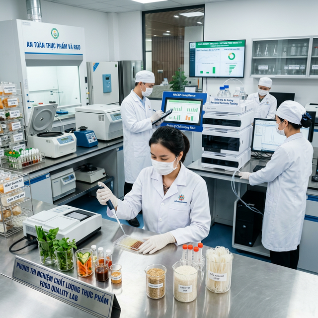
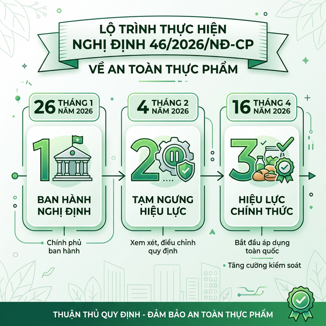
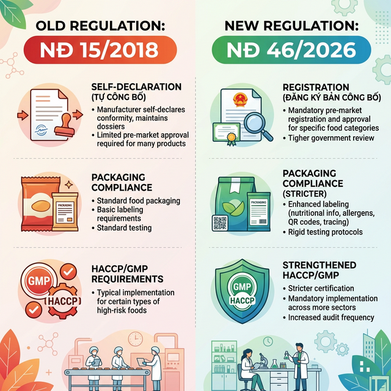

# Nghị định 46/2026 về an toàn thực phẩm — toàn bộ điểm mới doanh nghiệp cần nắm

Ngày 26/01/2026, Chính phủ chính thức ban hành **Nghị định 46/2026/NĐ-CP** — văn bản thay thế hoàn toàn Nghị định 15/2018/NĐ-CP đã áp dụng suốt 8 năm. Chỉ chưa đầy 10 ngày sau, Nghị quyết 09/2026/NQ-CP được ban hành để **tạm ngưng** hiệu lực nghị định này.

Điều đó cho thấy mức độ tác động lớn của NĐ 46/2026 đến toàn bộ chuỗi giá trị ngành thực phẩm. Doanh nghiệp F&B — từ nhà sản xuất, đơn vị cung ứng nguyên liệu cho đến bộ phận R&D và thu mua — cần hiểu rõ từng thay đổi để chuẩn bị kịp thời.

Bài viết này phân tích toàn bộ nội dung NĐ 46/2026/NĐ-CP, so sánh trực tiếp với NĐ 15/2018, đánh giá tác động thực tế và đưa ra hướng dẫn tuân thủ cụ thể cho doanh nghiệp ngành thực phẩm.

---

## Tổng quan Nghị định 46/2026/NĐ-CP

**Nghị định 46/2026/NĐ-CP** là văn bản quy phạm pháp luật do Chính phủ ban hành ngày 26/01/2026. Nghị định quy định chi tiết thi hành một số điều và biện pháp để tổ chức, hướng dẫn thi hành **Luật An toàn thực phẩm số 55/2010/QH12**.

### Bối cảnh và lý do ban hành

Nghị định 15/2018/NĐ-CP đã áp dụng suốt 8 năm. Trong giai đoạn đó, ngành thực phẩm Việt Nam thay đổi mạnh mẽ. Thương mại điện tử bùng nổ, yêu cầu truy xuất nguồn gốc ngày càng khắt khe, và xu hướng quốc tế chuyển dịch sang mô hình **tiền kiểm** thay vì hậu kiểm đơn thuần.

NĐ 46/2026 ra đời nhằm cập nhật khung pháp lý theo thực tế thị trường. Nghị định hướng đến ba mục tiêu: **chuẩn hóa quy trình quản lý** theo thông lệ quốc tế, **tăng cường trách nhiệm** của tất cả bên liên quan, và **đảm bảo minh bạch** trong chuỗi cung ứng thực phẩm.

### Phạm vi điều chỉnh và đối tượng áp dụng

Nghị định gồm **10 chương**, áp dụng cho tổ chức, cá nhân Việt Nam và nước ngoài tại Việt Nam tham gia sản xuất, kinh doanh thực phẩm. Phạm vi bao quát toàn bộ hoạt động liên quan đến an toàn thực phẩm: từ công bố sản phẩm, giấy phép cơ sở, kiểm tra nhập khẩu, cho đến ghi nhãn và quảng cáo.

| Thông tin | Chi tiết |
|-----------|----------|
| **Số hiệu** | 46/2026/NĐ-CP |
| **Ngày ban hành** | 26/01/2026 |
| **Cơ quan ban hành** | Chính phủ |
| **Căn cứ pháp lý** | Luật ATTP 55/2010/QH12 |
| **Thay thế** | NĐ 15/2018/NĐ-CP (toàn bộ) |
| **Bãi bỏ** | Một số quy định NĐ 38/2012/NĐ-CP |

### Văn bản bị thay thế và bãi bỏ

NĐ 46/2026 **thay thế toàn bộ** Nghị định 15/2018/NĐ-CP — văn bản đã là "xương sống" của hệ thống quản lý an toàn thực phẩm Việt Nam suốt 8 năm qua. Đồng thời, nghị định cũng bãi bỏ một số quy định tại NĐ 38/2012/NĐ-CP không còn phù hợp.

---

## Timeline hiệu lực — từ ban hành đến tạm ngưng

Quá trình NĐ 46/2026 đi vào hiệu lực không suôn sẻ. Dưới đây là timeline đầy đủ mà doanh nghiệp cần theo dõi.

### Ngày ban hành và hiệu lực ban đầu (26/01/2026)

NĐ 46/2026 có hiệu lực **ngay từ ngày ban hành** — 26/01/2026. Đây là điểm khác biệt so với nhiều nghị định thường có "thời gian đệm" 30–45 ngày. Điều này tạo áp lực lớn lên doanh nghiệp và địa phương trong việc chuyển đổi.

### Tạm ngưng bởi Nghị quyết 09/2026/NQ-CP (04/02/2026)

Chỉ 9 ngày sau khi ban hành, Chính phủ ban hành **Nghị quyết 09/2026/NQ-CP** tạm ngưng hiệu lực NĐ 46 đến hết ngày **15/04/2026**.

Lý do chính: nhiều địa phương chưa đủ nguồn lực triển khai, hệ thống kiểm nghiệm quá tải, và các thủ tục chuyển tiếp gây vướng mắc. Trong thời gian tạm ngưng, **NĐ 15/2018/NĐ-CP tiếp tục được áp dụng**.

### Hiệu lực chính thức từ 16/04/2026

NĐ 46/2026 sẽ chính thức có hiệu lực trở lại từ ngày **16/04/2026**. Hồ sơ đã nộp trước ngày này được xử lý theo quy định cũ, trừ trường hợp doanh nghiệp tự nguyện áp dụng quy định mới.

| Sự kiện | Ngày | Ghi chú |
|---------|------|---------|
| Ban hành NĐ 46/2026 | 26/01/2026 | Hiệu lực ngay |
| NQ 09/2026 tạm ngưng | 04/02/2026 | NĐ 15/2018 tiếp tục áp dụng |
| Hết tạm ngưng | 15/04/2026 | — |
| **Hiệu lực chính thức** | **16/04/2026** | NĐ 15/2018 hết hiệu lực |
| Hạn chót HACCP/GMP | 31/12/2026 | Nhóm sản phẩm đặc biệt |

---

## 7 điểm mới quan trọng so với Nghị định 15/2018

Đây là phần quan trọng nhất. Mỗi thay đổi dưới đây đều ảnh hưởng trực tiếp đến quy trình vận hành của doanh nghiệp F&B.

### Chuyển đổi từ tự công bố sang đăng ký công bố hợp quy

Đây là thay đổi **lớn nhất** của NĐ 46/2026. Trước đây, NĐ 15/2018 cho phép đa số sản phẩm thực phẩm **tự công bố** — doanh nghiệp tự chịu trách nhiệm và kinh doanh ngay mà không cần phê duyệt.

NĐ 46/2026 chuyển sang cơ chế **đăng ký bản công bố hợp quy** đối với sản phẩm đã có Quy chuẩn kỹ thuật (QCVN). Các nhóm sản phẩm phải đăng ký gồm:

- Thực phẩm đã qua chế biến bao gói sẵn
- Phụ gia thực phẩm
- Chất hỗ trợ chế biến thực phẩm
- Dụng cụ, bao bì tiếp xúc trực tiếp với thực phẩm

Thời hạn của bản công bố hợp quy **không quá 3 năm** và phải được cập nhật khi quy chuẩn kỹ thuật thay đổi.

> **Chuyên gia WIN Flavor:** Đối với ngành hương liệu thực phẩm, việc chuyển từ tự công bố sang đăng ký công bố hợp quy đồng nghĩa với việc doanh nghiệp cần chuẩn bị đầy đủ hồ sơ kỹ thuật — từ COA (Certificate of Analysis), Specification, đến kết quả kiểm nghiệm theo QCVN tương ứng. WIN Flavor cung cấp trọn bộ hồ sơ kỹ thuật cho mọi nguyên liệu, giúp rút ngắn thời gian đăng ký công bố hợp quy.

### Quản lý bao bì, dụng cụ tiếp xúc thực phẩm

**Lần đầu tiên**, bao bì và dụng cụ tiếp xúc trực tiếp với thực phẩm được đưa vào diện quản lý chặt chẽ. NĐ 46/2026 yêu cầu:

- Đáp ứng tiêu chuẩn kỹ thuật theo QCVN 12-1 đến 12-4 (nhựa, cao su, kim loại, thủy tinh/gốm sứ)
- Chuẩn bị hồ sơ đầy đủ cho đăng ký công bố hợp quy
- Kiểm tra nhà nước nghiêm ngặt, đặc biệt khâu nhập khẩu

Điều này ảnh hưởng trực tiếp đến ngành sản xuất thực phẩm vì bao bì không chỉ cần đạt tiêu chuẩn an toàn mà còn phải **tương thích** với sản phẩm chứa bên trong — đặc biệt khi sản phẩm có chứa hương liệu hoặc phụ gia.

### Bắt buộc HACCP/GMP cho nhóm sản phẩm đặc biệt

NĐ 46/2026 lần đầu thiết lập **lộ trình bắt buộc** áp dụng hệ thống quản lý an toàn thực phẩm chuẩn quốc tế. Các cơ sở sản xuất nhóm sản phẩm sau phải hoàn thành trước **31/12/2026**:

- Thực phẩm dinh dưỡng y học
- Thực phẩm dùng cho chế độ ăn đặc biệt
- Thực phẩm bổ sung (thực phẩm bảo vệ sức khỏe)
- Sản phẩm dinh dưỡng cho trẻ đến 36 tháng tuổi

Tiêu chuẩn được chấp nhận bao gồm: **HACCP**, ISO 22000, IFS, BRC, FSSC 22000, hoặc **GMP**. Đây không còn là lựa chọn — đây là yêu cầu bắt buộc.

### Siết chặt kiểm tra thực phẩm nhập khẩu

NĐ 46/2026 mở rộng đối tượng và chuẩn hóa toàn bộ quy trình kiểm tra an toàn thực phẩm nhập khẩu. Thay đổi đáng chú ý nhất:

**Bãi bỏ quy định miễn kiểm tra** đối với nguyên liệu, phụ gia, chất hỗ trợ chế biến và bao bì nhập khẩu chỉ dùng để sản xuất nội bộ. Trước đây, NĐ 15/2018 miễn kiểm tra cho nhóm này suốt 8 năm.

Việc bãi bỏ này tạo áp lực chi phí không nhỏ. Doanh nghiệp nhập khẩu nguyên liệu cần đảm bảo nhà cung cấp cung cấp đầy đủ giấy tờ: CO (Giấy chứng nhận xuất xứ), CA (Giấy phân tích), các chứng nhận Halal, Kosher nếu cần.

### Trách nhiệm sàn thương mại điện tử

**Lần đầu tiên**, NĐ 46/2026 ràng buộc trách nhiệm của sàn giao dịch thương mại điện tử đối với quảng cáo thực phẩm. Sàn TMĐT phải đảm bảo sản phẩm thực phẩm được quảng cáo đúng quy định pháp luật.

Đây là bước tiến phù hợp với thực tế thị trường khi thương mại điện tử chiếm tỷ trọng ngày càng lớn trong phân phối thực phẩm.

### Truy xuất nguồn gốc chi tiết hơn

NĐ 46/2026 bổ sung quy định cụ thể hơn về truy xuất nguồn gốc. Cơ sở sản xuất, kinh doanh phải lưu trữ đầy đủ thông tin:

- Nguyên liệu đầu vào
- Bán thành phẩm và thành phẩm
- Lô sản xuất, thời gian, địa điểm sản xuất
- Đơn vị cung cấp, phân phối, kinh doanh sản phẩm

Dữ liệu truy xuất phải **sẵn sàng cung cấp** cho cơ quan quản lý nhà nước khi có yêu cầu, và phải kích hoạt truy xuất khi phát hiện nguy cơ thực phẩm không an toàn.

### Tái khẳng định vai trò Giấy chứng nhận cơ sở đủ điều kiện ATTP

NĐ 46/2026 khẳng định **GCN ATTP là điều kiện pháp lý bắt buộc**. Các chứng nhận như ISO 22000 hay HACCP **không thể thay thế** GCN ATTP — chấm dứt cách hiểu sai phổ biến trước đây.

GCN ATTP có giá trị **3 năm** kể từ ngày cấp. Nghị định cũng bổ sung và làm rõ danh sách đối tượng được **miễn** GCN ATTP, bao gồm: sản xuất ban đầu nhỏ lẻ, kinh doanh thực phẩm bao gói sẵn, kinh doanh không có địa điểm cố định, bếp ăn tập thể không đăng ký ngành nghề, và thức ăn đường phố.

**Bảng so sánh NĐ 46/2026 và NĐ 15/2018:**

| Nội dung | NĐ 15/2018 | NĐ 46/2026 |
|----------|------------|-------------|
| **Cơ chế công bố sản phẩm** | Tự công bố (đa số SP) | Đăng ký công bố hợp quy (SP có QCVN) |
| **Bao bì tiếp xúc TP** | Quản lý lỏng | Đăng ký công bố hợp quy + kiểm tra nhập khẩu |
| **HACCP/GMP** | Khuyến khích | Bắt buộc cho nhóm SP đặc biệt (hạn chót 31/12/2026) |
| **GCN ATTP** | Có thể thay bằng ISO/HACCP (hiểu nhầm) | Bắt buộc, ISO/HACCP không thay thế |
| **Kiểm tra NK nội bộ** | Miễn kiểm tra | Bãi bỏ miễn kiểm |
| **Sàn TMĐT** | Không quy định | Ràng buộc trách nhiệm quảng cáo |
| **Truy xuất nguồn gốc** | Quy định chung | Chi tiết: nguyên liệu → thành phẩm → phân phối |

---

## Tác động thực tế đến doanh nghiệp F&B

### Chi phí tuân thủ tăng — "Phí chồng phí"

Liên đoàn Thương mại và Công nghiệp Việt Nam (VCCI) đã báo cáo nhiều vướng mắc nghiêm trọng. Khối lượng kiểm nghiệm **tăng đột biến** trong khi năng lực hệ thống phòng lab trong nước không đáp ứng. Nhiều doanh nghiệp buộc phải gửi mẫu kiểm nghiệm ra nước ngoài với chi phí rất lớn.

Việc bãi bỏ miễn kiểm tra nhập khẩu cho nguyên liệu sản xuất nội bộ tạo thêm "cú sốc" chi phí. Các hiệp hội doanh nghiệp phản ánh tình trạng **"phí chồng phí"** bào mòn sức cạnh tranh của toàn chuỗi cung ứng. VCCI đã kiến nghị kéo dài thời gian tạm ngưng NĐ 46 cho đến khi Luật ATTP sửa đổi được Quốc hội thông qua.

### Doanh nghiệp nhỏ và vừa chịu áp lực lớn nhất

Việc đầu tư hạ tầng HACCP/GMP đòi hỏi nguồn lực đáng kể — từ xây dựng phòng sạch, hệ thống giám sát, đến đào tạo nhân sự. Đối với doanh nghiệp nhỏ, chi phí chuyển đổi từ "tự công bố" sang "đăng ký công bố hợp quy" cũng là gánh nặng khi phải bổ sung kiểm nghiệm, hồ sơ kỹ thuật và phí đăng ký.

### Cơ hội cho doanh nghiệp "đi trước"

Mặt tích cực: doanh nghiệp tuân thủ sớm sẽ có **lợi thế cạnh tranh** rõ rệt. Khi NĐ 46 chính thức hiệu lực từ 16/04/2026, các đơn vị đã sẵn sàng sẽ không bị gián đoạn sản xuất và kinh doanh. Đặc biệt trong lĩnh vực xuất khẩu, việc đáp ứng HACCP/GMP trước hạn chót giúp doanh nghiệp mở rộng thị trường.

---

## Hướng dẫn tuân thủ Nghị định 46/2026 cho doanh nghiệp F&B

Dưới đây là lộ trình 5 bước giúp doanh nghiệp chuẩn bị kịp thời.

### Bước 1 — Rà soát sản phẩm và phân loại nhóm công bố

Xác định sản phẩm nào thuộc diện đăng ký công bố hợp quy (đã có QCVN) và sản phẩm nào vẫn được tự công bố. Ưu tiên rà soát: thực phẩm bao gói sẵn, phụ gia thực phẩm, hương liệu, và bao bì tiếp xúc.

### Bước 2 — Chuẩn bị hồ sơ đăng ký công bố hợp quy

Hồ sơ cần có: COA (Certificate of Analysis), Specification sản phẩm, kết quả kiểm nghiệm theo QCVN tương ứng, và bản cam kết tuân thủ. Đối với nguyên liệu nhập khẩu, cần bổ sung CO, CA và chứng nhận quốc tế (ISO, Halal, Kosher nếu có).

### Bước 3 — Xây dựng hệ thống HACCP/GMP (nếu thuộc nhóm bắt buộc)

Nếu doanh nghiệp sản xuất thực phẩm dinh dưỡng y học, thực phẩm bổ sung, thực phẩm cho trẻ dưới 36 tháng tuổi hoặc thực phẩm chế độ ăn đặc biệt — phải hoàn thành xây dựng và vận hành HACCP, ISO 22000, IFS, BRC, FSSC 22000 hoặc GMP **trước 31/12/2026**.

### Bước 4 — Rà soát chuỗi cung ứng và truy xuất nguồn gốc

Kiểm tra toàn bộ nhà cung cấp nguyên liệu. Đảm bảo có đầy đủ thông tin truy xuất: nguồn gốc, lô sản xuất, thời gian, COA cho từng lô hàng. Thiết lập hệ thống lưu trữ sẵn sàng cung cấp cho cơ quan quản lý khi yêu cầu.

### Bước 5 — Liên hệ đối tác R&D có năng lực tư vấn

Đối tác R&D chuyên nghiệp giúp rút ngắn thời gian tuân thủ. Từ việc tối ưu công thức (formulation) theo yêu cầu HACCP/GMP, đến chuẩn bị hồ sơ kỹ thuật đầy đủ cho đăng ký công bố hợp quy.

> **Chuyên gia WIN Flavor:** Với **8+ năm kinh nghiệm** và **638+ dự án R&D** thành công, WIN Flavor hỗ trợ doanh nghiệp F&B từ khâu tư vấn công thức — nguyên liệu — cho đến chuẩn bị trọn bộ hồ sơ kỹ thuật (COA, Specification, kết quả kiểm nghiệm). 100% nguyên liệu WIN Flavor có nguồn gốc minh bạch từ đối tác toàn cầu, đáp ứng mọi yêu cầu truy xuất theo NĐ 46/2026.

---

## Quy định xử phạt vi phạm an toàn thực phẩm 2026

Doanh nghiệp cũng cần lưu ý: hệ thống chế tài xử phạt ATTP vẫn được quy định tại **NĐ 115/2018/NĐ-CP** và **NĐ 124/2021/NĐ-CP** (sửa đổi, bổ sung NĐ 115). Mức phạt không hề nhẹ.

### Mức phạt trần cho cá nhân và tổ chức

- **Cá nhân**: Phạt tối đa **100.000.000 đồng** cho vi phạm thông thường
- **Tổ chức**: Phạt tối đa **200.000.000 đồng**

### Cơ chế "phá trần" — phạt gấp 7 lần giá trị hàng hóa

Khi giá trị hàng hóa vi phạm **từ 100 triệu đồng trở lên** đối với các hành vi nghiêm trọng (nguồn gốc, nhập khẩu...), mức phạt sẽ là **gấp 7 lần giá trị hàng hóa** — không bị giới hạn bởi mức trần 200 triệu.

| Đối tượng | Mức phạt trần | Phạt "phá trần" |
|-----------|--------------|-----------------|
| Cá nhân | 100 triệu đồng | Gấp 7x giá trị hàng hóa (≥100 triệu) |
| Tổ chức | 200 triệu đồng | Gấp 7x giá trị hàng hóa (≥100 triệu) |

---

## Câu hỏi thường gặp về Nghị định 46/2026

### Nghị định 46/2026 có hiệu lực từ ngày nào?

NĐ 46/2026/NĐ-CP có hiệu lực chính thức từ ngày **16/04/2026**. Ban đầu nghị định có hiệu lực từ 26/01/2026 nhưng đã bị tạm ngưng bởi Nghị quyết 09/2026/NQ-CP đến hết ngày 15/04/2026.

### Nghị định 46 khác gì so với Nghị định 15/2018?

NĐ 46/2026 có 7 thay đổi lớn so với NĐ 15/2018. Quan trọng nhất: chuyển từ **tự công bố** sang **đăng ký công bố hợp quy**, bắt buộc HACCP/GMP cho nhóm sản phẩm đặc biệt (hạn chót 31/12/2026), siết chặt kiểm tra nhập khẩu, và lần đầu ràng buộc sàn TMĐT.

### Doanh nghiệp nào bắt buộc áp dụng HACCP/GMP theo NĐ 46?

Cơ sở sản xuất thực phẩm dinh dưỡng y học, thực phẩm chế độ ăn đặc biệt, thực phẩm bổ sung, và sản phẩm dinh dưỡng cho trẻ đến 36 tháng tuổi phải áp dụng HACCP, ISO 22000, IFS, BRC, FSSC 22000 hoặc GMP trước **31/12/2026**.

### Trong thời gian tạm ngưng, doanh nghiệp áp dụng quy định nào?

NĐ 15/2018/NĐ-CP tiếp tục có hiệu lực trong thời gian tạm ngưng NĐ 46 (đến hết 15/04/2026). Doanh nghiệp có thể tự nguyện áp dụng quy định mới nếu đã sẵn sàng.

### NĐ 46 có ảnh hưởng đến ngành hương liệu thực phẩm không?

Có. Hương liệu thực phẩm thuộc nhóm **phụ gia thực phẩm**, phải đăng ký công bố hợp quy theo Quy chuẩn kỹ thuật và tuân thủ danh mục phụ gia cho phép trong **Văn bản hợp nhất 09/VBHN-BYT (2024)**. Mức sử dụng tối đa (Maximum Level) phải đảm bảo trong phạm vi quy định.

---

## Kết luận

Nghị định 46/2026/NĐ-CP đánh dấu bước chuyển mình trong quản lý an toàn thực phẩm Việt Nam — từ mô hình **hậu kiểm lỏng** sang **tiền kiểm có hệ thống**. 7 thay đổi trọng tâm không chỉ ảnh hưởng đến thủ tục hành chính mà tác động trực tiếp đến chi phí vận hành, quy trình R&D, và chuỗi cung ứng của mọi doanh nghiệp F&B.

Thời gian tạm ngưng đến 15/04/2026 là "cửa sổ" quý giá để doanh nghiệp rà soát sản phẩm, chuẩn bị hồ sơ, và xây dựng hệ thống tuân thủ. Đừng đợi đến khi nghị định chính thức có hiệu lực mới bắt đầu hành động.

**WIN Flavor** (MQ Ingredients) — với **8+ năm kinh nghiệm** chuyên sâu, **638+ dự án R&D** thành công và **138+ khách hàng** nhà máy F&B — sẵn sàng đồng hành cùng doanh nghiệp trong hành trình tuân thủ NĐ 46/2026. Từ tư vấn formulation, cung cấp nguyên liệu có hồ sơ đầy đủ, đến hỗ trợ đăng ký công bố hợp quy.

📞 **Liên hệ WIN Flavor** để nhận tư vấn miễn phí và giải pháp nguyên liệu tuân thủ quy định mới.
