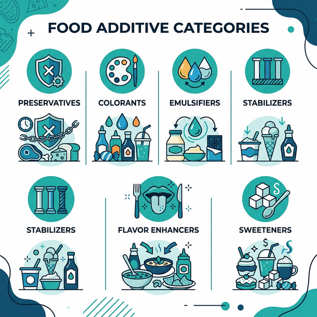

| | |
|---|---|
| **Keyword chính** | Quy định về phụ gia thực phẩm |
| **Keyword phụ** | Phụ gia thực phẩm được quy định là gì |
| | Danh mục phụ gia thực phẩm được phép sử dụng |
| | Công bố phụ gia thực phẩm |
| | Mức phạt vi phạm phụ gia thực phẩm |
| | Nghị định 46/2026 phụ gia thực phẩm |
| | Thông tư 24/2019 phụ gia thực phẩm |
| **Slug** | quy-dinh-ve-phu-gia-thuc-pham |
| **Meta title** | Quy định về phụ gia thực phẩm - toàn bộ khung pháp lý doanh nghiệp F&B cần biết [2026] |
| **Meta description** | Tổng hợp toàn bộ quy định về phụ gia thực phẩm tại Việt Nam: danh mục 400+ phụ gia, nguyên tắc sử dụng, quy trình công bố (NĐ 15 → NĐ 46/2026), mức phạt. Cập nhật tháng 3/2026. |
| **Outline** | H1: Quy định về phụ gia thực phẩm: toàn bộ khung pháp lý doanh nghiệp F&B cần biết [2026] |
| | - H2: Phụ gia thực phẩm được quy định là gì? |
| | -- H3: Phân biệt phụ gia thực phẩm với các khái niệm liên quan |
| | - H2: Phân loại nhóm chức năng phụ gia thực phẩm |
| | -- H3: Các nhóm chức năng phổ biến |
| | -- H3: Hệ thống mã INS |
| | - H2: Hệ thống văn bản pháp luật quản lý phụ gia thực phẩm tại Việt Nam |
| | -- H3: Luật ATTP 55/2010/QH12 |
| | -- H3: NĐ 15/2018 (sẽ bị thay thế từ 16/04/2026) |
| | -- H3: NĐ 46/2026 - văn bản mới thay thế NĐ 15/2018 (MỚI) |
| | -- H3: TT 24/2019 - văn bản lõi về phụ gia |
| | -- H3: TT 17/2023 - cập nhật Codex |
| | -- H3: VBHN 09/VBHN-BYT (2024) |
| | -- H3: NĐ 148/2025 - phân cấp quản lý |
| | - H2: Danh mục phụ gia thực phẩm được phép sử dụng |
| | -- H3: Cách tra cứu danh mục phụ gia |
| | -- H3: Một số phụ gia phổ biến và mức sử dụng tối đa |
| | - H2: 6 nguyên tắc sử dụng phụ gia thực phẩm |
| | - H2: Quy định về công bố phụ gia thực phẩm |
| | -- H3: Quy trình hiện hành theo NĐ 15/2018 |
| | -- H3: Quy trình mới theo NĐ 46/2026 (MỚI) |
| | -- H3: Bảng so sánh NĐ 15/2018 vs NĐ 46/2026 |
| | - H2: Quy định về ghi nhãn phụ gia thực phẩm |
| | - H2: Mức phạt vi phạm quy định về phụ gia thực phẩm |
| | - H2: Cập nhật quy định phụ gia mới nhất 2025-2026 |
| | -- H3: NĐ 46/2026 - thay đổi lớn nhất |
| | -- H3: NĐ 148/2025 - phân cấp ATTP |
| | -- H3: QĐ 988/2025 - đính chính TT 15/2024 |
| | -- H3: Codex STAN 192-1995 - cập nhật 2024-2025 |
| | -- H3: Quy định hương liệu (JECFA/FEMA/EU) |
| | -- H3: Năm 2026: hậu kiểm và minh bạch hóa |
| | - H2: Giải pháp WIN Flavor |
| | - H2: Câu hỏi thường gặp (6 FAQ) |
| | - H2: Kết luận |

---

# Quy định về phụ gia thực phẩm: toàn bộ khung pháp lý doanh nghiệp F&B cần biết [2026]

Với hơn 400 loại phụ gia thực phẩm được phép sử dụng tại Việt Nam, việc nắm rõ **quy định về phụ gia thực phẩm** không chỉ là nghĩa vụ pháp lý - mà còn là chiến lược bảo vệ thương hiệu khỏi rủi ro bị phạt hàng trăm triệu đồng, thậm chí bị buộc tiêu hủy sản phẩm.

Bài viết này tổng hợp toàn bộ khung pháp lý về phụ gia thực phẩm tại Việt Nam - từ định nghĩa, danh mục pháp lý, nguyên tắc sử dụng, quy trình công bố sản phẩm, đến mức xử phạt vi phạm. Tất cả được cập nhật theo **Nghị định 46/2026/NĐ-CP** (có hiệu lực từ 16/04/2026, thay thế NĐ 15/2018) và **Văn bản hợp nhất 09/VBHN-BYT (2024)** - hai tài liệu tra cứu chính thức mới nhất tính đến tháng 3/2026.

[key_takeaways]
- Việt Nam hiện cho phép sử dụng khoảng **400 loại phụ gia thực phẩm**, được quy định tại Thông tư 24/2019 và cập nhật trong VBHN 09/VBHN-BYT (2024).
- **NĐ 46/2026** (hiệu lực 16/04/2026) thay thế NĐ 15/2018, chuyển từ cơ chế "tự công bố" sang **đăng ký công bố hợp quy** cho tất cả phụ gia thực phẩm.
- **NĐ 148/2025** phân cấp quản lý ATTP về cấp tỉnh, kết hợp xu hướng **thanh tra đột xuất và hậu kiểm diện rộng** trong năm 2026.
- Mức phạt vi phạm phụ gia: từ 40-100 triệu VNĐ, trường hợp nghiêm trọng lên đến **gấp 5-7 lần giá trị hàng hóa**.
- Hương liệu thực phẩm phải thuộc ít nhất 1 trong 3 danh mục: **JECFA, FEMA (GRAS), hoặc EU**.
- Doanh nghiệp cần chuẩn bị hồ sơ kỹ thuật đầy đủ (COA, Specification Sheet, chứng nhận hợp quy) để sẵn sàng chuyển đổi sang quy trình NĐ 46/2026.

[/key_takeaways]

---

## Phụ gia thực phẩm được quy định là gì?

Theo **Ủy ban Tiêu chuẩn thực phẩm quốc tế (Codex Alimentarius Commission - CAC)**, phụ gia thực phẩm là chất có hoặc không có giá trị dinh dưỡng, bản thân nó không được tiêu thụ thông thường như thực phẩm. Việc bổ sung có chủ đích vào thực phẩm nhằm giải quyết **mục đích công nghệ** trong sản xuất, chế biến, bao gói, bảo quản hoặc vận chuyển.

Tại Việt Nam, **Luật An toàn thực phẩm số 55/2010/QH12** định nghĩa phụ gia thực phẩm là chất được chủ định đưa vào thực phẩm trong quá trình sản xuất, có hoặc không có giá trị dinh dưỡng, nhằm giữ hoặc cải thiện đặc tính kỹ thuật của thực phẩm.

### Phân biệt phụ gia thực phẩm với các khái niệm liên quan

| Tiêu chí | Phụ gia thực phẩm | Chất hỗ trợ chế biến | Chất ô nhiễm |
|----------|-------------------|----------------------|--------------|
| **Mục đích** | Đạt hiệu quả công nghệ (bảo quản, tạo màu, tạo cấu trúc…) | Hỗ trợ quá trình sản xuất (lọc, tẩy…) | Không chủ đích - lẫn vào ngoài ý muốn |
| **Có mặt trong sản phẩm?** | Có - cố ý để lại | Không hoặc rất ít (loại bỏ sau chế biến) | Có - nhưng không mong muốn |
| **Ghi nhãn?** | Bắt buộc | Không bắt buộc (nếu đã loại bỏ) | Không ghi nhãn |
| **Ví dụ** | Sodium benzoate, MSG, Tartrazine | Enzyme, than hoạt tính | Kim loại nặng, nấm mốc |

Hiểu đúng **phụ gia thực phẩm được quy định là gì** giúp doanh nghiệp tránh nhầm lẫn giữa phụ gia (có quản lý bằng danh mục) và chất hỗ trợ chế biến (quản lý khác biệt). Đây là lỗi phổ biến khiến nhiều doanh nghiệp F&B gặp vướng mắc khi làm hồ sơ công bố sản phẩm.

---

## Phân loại nhóm chức năng phụ gia thực phẩm

Thông tư 24/2019/TT-BYT phân loại phụ gia thực phẩm thành nhiều nhóm chức năng. Mỗi nhóm đảm nhận vai trò công nghệ riêng biệt trong sản xuất thực phẩm.

### Các nhóm chức năng phổ biến

| STT | Nhóm chức năng | Ví dụ phụ gia phổ biến | Ứng dụng |
|-----|---------------|----------------------|----------|
| 1 | Chất bảo quản | Sodium benzoate (INS 211), Sorbic acid (INS 200) | Ngăn vi sinh vật, kéo dài hạn dùng |
| 2 | Chất tạo màu | Tartrazine (INS 102), Caramel (INS 150a) | Tạo màu hấp dẫn cho thực phẩm |
| 3 | Chất nhũ hóa | Lecithin (INS 322), Mono-/Diglyceride (INS 471) | Ổn định cấu trúc, ngăn tách lớp |
| 4 | Chất ổn định | Pectin (INS 440), Xanthan gum (INS 415) | Duy trì kết cấu đồng nhất |
| 5 | Chất điều vị | MSG (INS 621), Disodium 5'-ribonucleotide (INS 635) | Tăng cường vị umami |
| 6 | Chất tạo ngọt | Aspartame (INS 951), Sucralose (INS 955) | Thay thế đường, giảm calo |
| 7 | Chất chống oxy hóa | BHA (INS 320), Tocopherol (INS 307) | Ngăn oxy hóa, giữ màu sắc |
| 8 | Chất tạo đặc | Agar (INS 406), Gelatin | Tạo độ sệt, đông kết |
| 9 | Chất tạo xốp | Sodium bicarbonate (INS 500i) | Tạo độ nở cho bánh |
| 10 | Chất chống vón | Silicon dioxide (INS 551) | Ngăn bột bị vón cục |
| 11 | Chất làm ẩm | Glycerol (INS 422), Sorbitol (INS 420) | Giữ ẩm cho sản phẩm |
| 12 | Chất điều chỉnh độ acid | Citric acid (INS 330), Lactic acid (INS 270) | Điều chỉnh pH thực phẩm |

### Hệ thống mã INS (International Numbering System)

**Mã INS** là hệ thống đánh số quốc tế do Codex xây dựng, giúp nhận diện phụ gia thực phẩm một cách thống nhất trên toàn cầu. Mỗi phụ gia được gán một mã số duy nhất:

- **INS 621** = Monosodium glutamate (bột ngọt/MSG)
- **INS 211** = Sodium benzoate (chất bảo quản)
- **INS 102** = Tartrazine (chất tạo màu vàng)

Khi ghi nhãn tại Việt Nam, doanh nghiệp cần ghi đúng tên phụ gia kèm mã INS tương ứng theo danh mục Thông tư 24/2019.

---

## Hệ thống văn bản pháp luật quản lý phụ gia thực phẩm tại Việt Nam

Việt Nam xây dựng hệ thống quản lý phụ gia thực phẩm theo cấu trúc phân tầng: **Luật → Nghị định → Thông tư → Văn bản hợp nhất**. Doanh nghiệp cần hiểu rõ vai trò của từng văn bản để tránh trích dẫn sai hoặc áp dụng quy định đã hết hiệu lực.

| Văn bản | Nội dung chính | Hiệu lực |
|---------|---------------|-----------|
| **Luật ATTP 55/2010/QH12** | Luật khung tối cao về an toàn thực phẩm | 01/07/2011 |
| **NĐ 15/2018/NĐ-CP** | Hướng dẫn chi tiết: Tự công bố, Đăng ký công bố, Kiểm tra nhập khẩu | 02/02/2018 |
| **NĐ 46/2026/NĐ-CP** (MỚI) | **Thay thế NĐ 15/2018** - Quy trình đăng ký công bố hợp quy | 16/04/2026 |
| **NQ 66.13/2026/NQ-CP** | Công bố, đăng ký sản phẩm thực phẩm (kèm NĐ 46) | 16/04/2026 |
| **TT 24/2019/TT-BYT** | Danh mục ~400 phụ gia + Mức sử dụng tối đa (ML) | 16/10/2019 |
| **TT 17/2023/TT-BYT** | Sửa đổi TT24: Cập nhật theo Codex, bổ sung quy định hương liệu | 09/11/2023 |
| **TT 08/2024/TT-BYT** | Sửa đổi bổ sung thêm TT24 | 24/05/2024 |
| **VBHN 09/VBHN-BYT (2024)** | Hợp nhất TT24 + TT17 + TT08 - **Bản tra cứu chính thức** | 06/09/2024 |
| **TT 15/2024/TT-BYT** | Danh mục phụ gia nhập khẩu phải kiểm tra ATTP (đính chính bởi QĐ 988/2025) | 02/11/2024 |
| **NĐ 148/2025/NĐ-CP** | Phân cấp quản lý y tế - chuyển thẩm quyền kiểm nghiệm về tỉnh | 01/07/2025 |
| **NĐ 115/2018 + NĐ 124/2021** | Xử phạt vi phạm an toàn thực phẩm | Hiện hành |
| **NĐ 43/2017 + NĐ 111/2021** | Ghi nhãn hàng hóa | Hiện hành |

### Luật an toàn thực phẩm 55/2010/QH12 - nền tảng pháp lý tối cao

Luật An toàn thực phẩm là văn bản cao nhất, thiết lập quyền và nghĩa vụ của tổ chức, cá nhân trong bảo đảm an toàn thực phẩm - bao gồm phụ gia thực phẩm. Mọi Nghị định và Thông tư đều phải phù hợp với luật này.

### Nghị định 15/2018/NĐ-CP - hướng dẫn thi hành chi tiết (sẽ bị thay thế từ 16/04/2026)

Nghị định 15 từng là "sổ tay vận hành" chính cho doanh nghiệp F&B, quy định rõ:
- Quy trình **tự công bố sản phẩm** (Điều 5)
- Quy trình **đăng ký bản công bố** (Điều 7–8)
- Chế độ kiểm tra nhà nước đối với thực phẩm nhập khẩu

> **Lưu ý**: Từ ngày **16/04/2026**, NĐ 15/2018 sẽ bị **thay thế hoàn toàn** bởi **Nghị định 46/2026/NĐ-CP**. Trong giai đoạn tạm ngưng (26/01 – 15/04/2026), NĐ 15/2018 vẫn tiếp tục có hiệu lực theo Nghị quyết 09/2026/NQ-CP.

### Nghị định 46/2026/NĐ-CP - văn bản mới thay thế NĐ 15/2018 (MỚI)

NĐ 46/2026 ban hành ngày 26/01/2026, chính thức có hiệu lực từ **16/04/2026** (sau giai đoạn tạm ngưng theo NQ 09/2026). Đây là thay đổi lớn nhất trong quản lý ATTP kể từ năm 2018:

- **Yêu cầu đăng ký công bố hợp quy** cho phụ gia thực phẩm, chất hỗ trợ chế biến, bao bì tiếp xúc trực tiếp với thực phẩm
- Bãi bỏ một số **trường hợp miễn tự công bố** từ NĐ 15/2018 - đặc biệt đối với nguyên liệu, phụ gia chỉ dùng sản xuất nội bộ
- Phối hợp với **Nghị quyết 66.13/2026/NQ-CP** quy định chi tiết về công bố và đăng ký sản phẩm thực phẩm

Doanh nghiệp cần chủ động rà soát hồ sơ công bố hiện tại để chuẩn bị chuyển đổi sang quy trình mới trước ngày 16/04/2026.

### Thông tư 24/2019/TT-BYT - văn bản lõi về quy định phụ gia thực phẩm

Đây là văn bản quan trọng nhất khi nói đến **quy định về phụ gia thực phẩm**, bao gồm:
- **Phụ lục 1**: Danh mục phụ gia thực phẩm được phép sử dụng (~400 loại)
- **Phụ lục 2A**: Mức sử dụng tối đa (ML) theo nhóm thực phẩm
- **Phụ lục 2B**: ML cho phụ gia chưa được Codex STAN 192-1995 quy định
- **Phụ lục 3**: Phụ gia sử dụng theo GMP (Thực hành sản xuất tốt)
- **Phụ lục 4**: Phân nhóm và mô tả nhóm thực phẩm

### Thông tư 17/2023/TT-BYT - cập nhật theo tiêu chuẩn Codex mới nhất

Thông tư 17/2023 sửa đổi, bổ sung Thông tư 24/2019 theo hai hướng chính:
1. **Cập nhật Phụ lục 2A và Phụ lục 3** theo Codex STAN 192-1995 phiên bản mới
2. **Bổ sung quy định hương liệu thực phẩm** (Khoản 4, Điều 5): Hương liệu phải thuộc 1 trong 3 danh mục - JECFA, FEMA (GRAS), hoặc Liên minh Châu Âu (EU)

### Văn bản hợp nhất 09/VBHN-BYT (2024) - bản tra cứu chính thức hiện hành

**VBHN 09/VBHN-BYT** ban hành ngày 06/09/2024 là văn bản hợp nhất TT 24/2019 + TT 17/2023 + TT 08/2024. Đây là tài liệu tra cứu chính thức mà doanh nghiệp cần sử dụng khi kiểm tra danh mục và mức sử dụng phụ gia.

### Nghị định 148/2025/NĐ-CP - phân cấp quản lý y tế

NĐ 148/2025 (hiệu lực 01/07/2025) phân cấp một số thủ tục hành chính trong lĩnh vực ATTP từ **trung ương xuống cấp tỉnh**:
- Chuyển thẩm quyền cấp Giấy chứng nhận ATTP cho thực phẩm xuất khẩu về cơ quan chuyên môn cấp tỉnh
- Chỉ định cơ sở kiểm nghiệm phục vụ quản lý nhà nước tại địa phương

Điều này đồng nghĩa doanh nghiệp cần **hồ sơ kỹ thuật chặt chẽ hơn** (COA, Specification Sheet, chứng nhận quốc tế) để đáp ứng yêu cầu kiểm tra tại cấp địa phương - nơi năng lực thẩm định có thể khác biệt so với Cục ATTP trung ương.

> **Lưu ý quan trọng**: Thông tư 46/2014/TT-BYT về phụ gia đã **hết hiệu lực**. Doanh nghiệp không nên trích dẫn văn bản này trong hồ sơ công bố hoặc tài liệu nội bộ.

---

## Danh mục phụ gia thực phẩm được phép sử dụng

Danh mục phụ gia thực phẩm được phép sử dụng tại Việt Nam hiện bao gồm khoảng **400 loại phụ gia**, được ban hành kèm Thông tư 24/2019 và cập nhật qua Thông tư 17/2023. Mỗi phụ gia được quy định rõ: tên Việt – Anh, mã INS, nhóm chức năng, đối tượng thực phẩm áp dụng, và **mức sử dụng tối đa (ML)**.

### Cách tra cứu danh mục phụ gia

Để tra cứu chính xác, doanh nghiệp thực hiện theo quy trình:

1. Xác định **tên phụ gia** hoặc **mã INS** cần tra cứu
2. Tra Phụ lục 1 (VBHN 09/2024) để xác nhận phụ gia có trong danh mục
3. Tra Phụ lục 2A/2B để xác định **mức sử dụng tối đa (ML)** cho nhóm thực phẩm cụ thể
4. Nếu ML ghi "GMP" → Tra Phụ lục 3 để hiểu điều kiện GMP

### Một số phụ gia phổ biến và mức sử dụng tối đa

| Phụ gia | Mã INS | Nhóm chức năng | ML ví dụ (mg/kg) | Nhóm thực phẩm |
|---------|--------|---------------|------------------|----------------|
| Sodium benzoate | 211 | Bảo quản | 1000 | Nước giải khát |
| Sorbic acid | 200 | Bảo quản | 1000 | Nước chấm |
| MSG | 621 | Điều vị | GMP | Nhiều nhóm |
| Tartrazine | 102 | Tạo màu | 100 | Kẹo, đồ uống |
| Aspartame | 951 | Tạo ngọt | 600 | Đồ uống không cồn |
| Caramel III | 150c | Tạo màu | 50000 | Bia, nước tương |
| Citric acid | 330 | Điều chỉnh acid | GMP | Nhiều nhóm |

> "Mức ML chỉ là giới hạn trần. Trong thực tế sản xuất, WIN Flavor luôn khuyến nghị sử dụng phụ gia ở mức **thấp hơn 20–30% so với ML** để vừa đảm bảo hiệu quả kỹ thuật, vừa tạo biên an toàn pháp lý cho doanh nghiệp. Đây là kinh nghiệm rút ra từ hơn 638 dự án R&D."

---

## 6 nguyên tắc sử dụng phụ gia thực phẩm

Điều 7 Thông tư 24/2019/TT-BYT (hợp nhất tại VBHN 09/2024) quy định **6 nguyên tắc bắt buộc** khi sử dụng phụ gia thực phẩm:

### Nguyên tắc 1: Đảm bảo an toàn cho sức khỏe con người

Mọi phụ gia sử dụng phải được đánh giá an toàn bởi các tổ chức quốc tế (JECFA, FDA) hoặc cơ quan quản lý Việt Nam. Phụ gia chưa được đánh giá an toàn không được phép sử dụng.

### Nguyên tắc 2: Phải thuộc danh mục được phép và đúng đối tượng

Phụ gia phải nằm trong danh mục Phụ lục 1 (TT 24/2019) **và** được sử dụng cho đúng nhóm thực phẩm quy định. Ví dụ: Một phụ gia được phép cho đồ uống nhưng không có nghĩa được dùng cho sản phẩm sữa.

### Nguyên tắc 3: Không vượt quá mức sử dụng tối đa (ML)

ML được xác định tại Phụ lục 2A/2B, tính bằng mg phụ gia trên kg (hoặc lít) thực phẩm. Vượt ML là vi phạm pháp luật.

### Nguyên tắc 4: Hạn chế đến mức thấp nhất (Nguyên tắc ALARA)

Doanh nghiệp phải sử dụng lượng phụ gia ít nhất có thể để đạt hiệu quả kỹ thuật mong muốn. Không được "tối đa hóa" liều lượng chỉ vì chưa vượt ML.

### Nguyên tắc 5: Không làm thay đổi bản chất thực phẩm

Phụ gia không được biến đổi bản chất của sản phẩm hoặc công nghệ sản xuất. Ví dụ: Không dùng quá nhiều chất tạo ngọt để biến sản phẩm mặn thành sản phẩm ngọt.

### Nguyên tắc 6: Hài hòa tiêu chuẩn quốc tế

Việc sử dụng phụ gia phải hài hòa với tiêu chuẩn Codex Alimentarius, cập nhật theo khuyến cáo quản lý rủi ro của cơ quan có thẩm quyền.

---

## Quy định về công bố phụ gia thực phẩm

Trước khi đưa phụ gia thực phẩm ra lưu thông trên thị trường, doanh nghiệp **bắt buộc** phải thực hiện thủ tục công bố sản phẩm. Tính đến tháng 3/2026, quy trình công bố đang trong **giai đoạn chuyển đổi** từ NĐ 15/2018 sang NĐ 46/2026.

### Quy trình hiện hành theo NĐ 15/2018 (áp dụng đến 15/04/2026)

#### Tự công bố sản phẩm (Điều 5, NĐ 15/2018)

Áp dụng cho **hầu hết phụ gia thực phẩm** thuộc danh mục được phép sử dụng:

- **Hồ sơ gồm**: Bản tự công bố (Mẫu 01 Phụ lục I NĐ 15) + Phiếu kết quả kiểm nghiệm còn hiệu lực 12 tháng
- **Phiếu kiểm nghiệm**: Do phòng kiểm nghiệm được chỉ định hoặc phòng được công nhận phù hợp **ISO 17025** cấp
- **Quy trình**: Doanh nghiệp tự thực hiện, nộp về cơ quan quản lý địa phương

#### Đăng ký bản công bố sản phẩm (Điều 7–8, NĐ 15/2018)

Áp dụng cho hai trường hợp đặc biệt:

1. **Phụ gia thực phẩm hỗn hợp có công dụng mới**: Phối trộn từ các phụ gia đã có nhưng tạo ra chức năng/công dụng chưa được quy định
2. **Phụ gia không thuộc danh mục** được phép sử dụng

Hồ sơ nộp tại **Cục An toàn thực phẩm (Bộ Y tế)**. Thời gian giải quyết tối đa 15 ngày làm việc.

### Quy trình mới theo NĐ 46/2026 (áp dụng từ 16/04/2026) (MỚI)

Từ ngày 16/04/2026, NĐ 46/2026 yêu cầu **đăng ký công bố hợp quy** cho tất cả phụ gia thực phẩm, chất hỗ trợ chế biến, bao bì tiếp xúc thực phẩm - thay thế hoàn toàn cơ chế tự công bố của NĐ 15/2018.

Điểm khác biệt lớn nhất:
- Phụ gia **đã có quy chuẩn kỹ thuật**: Đăng ký công bố hợp quy
- Phụ gia **chưa có quy chuẩn**: Công bố tiêu chuẩn áp dụng theo Điều 6 Nghị quyết 66.13/2026/NQ-CP
- **Bãi bỏ miễn tự công bố** cho nguyên liệu, phụ gia sản xuất nội bộ (không tiêu thụ trên thị trường)

### Bảng so sánh: NĐ 15/2018 vs NĐ 46/2026

| Tiêu chí | NĐ 15/2018 (hiện hành) | NĐ 46/2026 (từ 16/04/2026) |
|----------|-----------|-------------------|
| **Cơ chế** | Tự công bố / Đăng ký công bố | Đăng ký công bố hợp quy / Công bố tiêu chuẩn |
| **Đối tượng** | Chia 2 nhóm (trong/ngoài danh mục) | Tất cả phụ gia, chất HTCB, bao bì |
| **Miễn công bố** | Có (NL nội bộ) | **Không** - bãi bỏ |
| **Văn bản kèm** | - | NQ 66.13/2026/NQ-CP |
| **Cơ sở pháp lý** | Điều 5, 7–8 NĐ 15 | NĐ 46/2026 + NQ 66.13/2026 |

---

## Quy định về ghi nhãn phụ gia thực phẩm

Ngoài việc **công bố phụ gia thực phẩm**, doanh nghiệp còn phải tuân thủ quy định ghi nhãn theo Nghị định 43/2017/NĐ-CP (sửa đổi bởi NĐ 111/2021) và Điều 12 Thông tư 24/2019.

### Nội dung bắt buộc trên nhãn phụ gia

Nhãn sản phẩm phụ gia thực phẩm phải có đầy đủ:
- Tên sản phẩm phụ gia
- Tên phụ gia theo danh mục TT 24/2019 kèm **mã INS**
- Tên và địa chỉ nhà sản xuất
- Xuất xứ (Origin)
- Hạn sử dụng
- Hướng dẫn sử dụng và bảo quản
- Định lượng/Hàm lượng

### Lưu ý đặc biệt khi ghi nhãn

- Phải ghi tên phụ gia **đúng theo tên trong danh mục** Thông tư 24 - không được dùng tên thương mại hoặc tên viết tắt tùy ý
- Với phụ gia nhập khẩu: phải ghi **xuất xứ** theo NĐ 43/2017 (quy định nghiêm ngặt về "Made in...")
- **WIN Flavor** cam kết cung cấp đầy đủ COA (Certificate of Analysis), Specification Sheet, và mã INS cho mọi sản phẩm - giúp doanh nghiệp ghi nhãn chính xác ngay từ lần đầu

---

## Mức phạt vi phạm quy định về phụ gia thực phẩm

Nghị định 115/2018/NĐ-CP (sửa đổi bởi NĐ 124/2021/NĐ-CP) quy định các mức xử phạt cụ thể cho hành vi vi phạm về phụ gia thực phẩm.

### Mức phạt theo hành vi vi phạm

| Hành vi vi phạm | Giá trị sản phẩm vi phạm | Mức phạt tiền |
|-----------------|--------------------------|---------------|
| Sử dụng phụ gia **ngoài danh mục** hoặc phụ gia **bị cấm** | Dưới 10 triệu VNĐ | 40–50 triệu VNĐ |
| Sử dụng phụ gia ngoài danh mục/bị cấm | Từ 10 triệu VNĐ trở lên | 80–100 triệu VNĐ |
| Sử dụng phụ gia **vượt mức ML** | Tùy mức vượt | 20–50 triệu VNĐ |
| Không thực hiện công bố sản phẩm | - | 30–40 triệu VNĐ |

### Cơ chế "phá trần" - mức phạt gấp 7 lần giá trị hàng hóa

Trong các trường hợp nghiêm trọng, khi **giá trị hàng hóa vi phạm từ 100 triệu VNĐ trở lên**, mức phạt được tính bằng **5–7 lần giá trị hàng hóa** - không bị giới hạn bởi mức trần thông thường.

Mức trần phạt thông thường:
- **Cá nhân**: 100 triệu VNĐ
- **Tổ chức**: 200 triệu VNĐ

### Biện pháp khắc phục hậu quả

Ngoài phạt tiền, doanh nghiệp vi phạm còn đối mặt với:
- **Buộc tiêu hủy** toàn bộ sản phẩm chứa phụ gia vi phạm
- **Thu hồi** sản phẩm đã lưu thông
- **Đình chỉ** hoạt động sản xuất (tùy mức độ)
- **Thông báo công khai** trên phương tiện truyền thông

---

## Cập nhật quy định phụ gia mới nhất 2025–2026

Hệ thống quy định phụ gia thực phẩm liên tục được cập nhật để hài hòa với tiêu chuẩn quốc tế. Dưới đây là những thay đổi quan trọng nhất trong giai đoạn 2025–2026.

### Nghị định 46/2026/NĐ-CP - thay đổi lớn nhất về công bố sản phẩm

Ban hành ngày 26/01/2026, NĐ 46 thay thế hoàn toàn NĐ 15/2018 và chuyển đổi sang cơ chế **đăng ký công bố hợp quy** cho phụ gia thực phẩm. Do nhiều vướng mắc phát sinh (ách tắc hàng hóa tại cửa khẩu), Chính phủ đã ban hành **Nghị quyết 09/2026/NQ-CP** tạm ngưng hiệu lực đến hết ngày 15/04/2026.

| Mốc thời gian | Sự kiện |
|---|---|
| 26/01/2026 | NĐ 46/2026 + NQ 66.13/2026 ban hành |
| 26/01 – 15/04/2026 | **Giai đoạn tạm ngưng** - NĐ 15/2018 vẫn áp dụng (NQ 09/2026) |
| 16/04/2026 | NĐ 46/2026 chính thức có hiệu lực, NĐ 15/2018 hết hiệu lực |

> "NĐ 46/2026 thay đổi căn bản quy trình công bố phụ gia. Doanh nghiệp cần chuẩn bị hồ sơ kỹ thuật chất lượng cao hơn - bao gồm COA, Specification Sheet, và chứng nhận hợp quy. WIN Flavor đã sẵn sàng hỗ trợ miễn phí bộ hồ sơ kỹ thuật cho đối tác."

### Nghị định 148/2025/NĐ-CP - phân cấp quản lý ATTP

Có hiệu lực từ 01/07/2025, NĐ 148/2025 phân cấp nhiều thủ tục ATTP từ Bộ Y tế xuống **cơ quan chuyên môn cấp tỉnh**. Điều này áp dụng cả cho việc cấp Giấy chứng nhận thực phẩm xuất khẩu và chỉ định cơ sở kiểm nghiệm.

Đối với doanh nghiệp sử dụng phụ gia, xu hướng chuyển từ kiểm tra hồ sơ sang **thanh tra đột xuất và hậu kiểm diện rộng** đồng nghĩa cần lưu trữ đầy đủ hồ sơ kỹ thuật tại nhà máy.

### Quyết định 988/QĐ-BYT (03/2025) - đính chính Thông tư 15/2024

Quyết định này đính chính hai nội dung quan trọng:
1. Sửa lỗi dẫn chiếu tại điểm d khoản 4 Điều 3
2. Loại bỏ dòng "II. Phụ gia thực phẩm đơn chất" trong Danh mục đính kèm

Doanh nghiệp nhập khẩu phụ gia cần đối chiếu **mã HS Code** theo Danh mục đã đính chính để xác định đúng nghĩa vụ kiểm tra nhà nước.

### Codex STAN 192-1995 - bản cập nhật 2024–2025

**Ủy ban Codex quốc tế** đã công bố các bản cập nhật liên tiếp:

- **Bản 2024** (hiệu lực 03/01/2025): Cập nhật mức sử dụng tối đa cho **144 phụ gia** thực phẩm, đồng thời bổ sung phụ gia mới và loại bỏ một số phụ gia cũ
- **Bản CAC48** (thông qua 11/2025): Rà soát hơn **500 quy định phụ gia**, tập trung vào chất tạo màu sử dụng trong các nhóm thực phẩm. Thu hồi một số quy định (ví dụ: annatto extracts gốc bixin cho sữa lên men) và thông qua quy định mới (ví dụ: annatto extracts gốc norbixin cho trái cây đóng hộp)

Việt Nam cam kết hài hòa với Codex, do đó các cập nhật này sẽ dần được tích hợp vào Thông tư 24/2019 qua các lần sửa đổi tiếp theo.

### Quy định hương liệu theo Thông tư 17/2023 (JECFA/FEMA/EU)

Khoản 4 Điều 5 (sửa đổi bởi TT 17/2023) quy định hương liệu dùng trong thực phẩm phải thuộc **ít nhất 1 trong 3 danh mục**:

1. Hương liệu đã được **JECFA** (Joint FAO/WHO Expert Committee on Food Additives) đánh giá an toàn
2. Hương liệu được **FEMA** (Flavor and Extract Manufacturers Association) công nhận GRAS
3. Hương liệu trong danh mục **Liên minh Châu Âu (EU)**

> "Toàn bộ danh mục hương liệu WIN Flavor đều có chứng nhận an toàn từ JECFA và FEMA - hai cơ quan uy tín nhất thế giới. Điều này giúp doanh nghiệp sử dụng hương liệu WIN Flavor hoàn toàn an tâm về mặt pháp lý, đồng thời thuận lợi khi làm hồ sơ công bố sản phẩm."

### Năm 2026: chuyển hướng sang hậu kiểm và minh bạch hóa

Năm 2026 được xem là năm của **minh bạch hóa** trong quản lý phụ gia thực phẩm. Các cơ quan chức năng chuyển dịch mạnh từ kiểm tra hồ sơ sang:
- **Thanh tra đột xuất** tại cơ sở sản xuất
- **Hậu kiểm diện rộng** đối với phụ gia lưu thông trên thị trường
- Yêu cầu **truy xuất nguồn gốc** đầy đủ của nguyên liệu phụ gia

Doanh nghiệp cần lưu trữ hồ sơ kỹ thuật (COA, Specification Sheet, chứng nhận xuất xứ) đầy đủ và sẵn sàng xuất trình khi cơ quan chức năng yêu cầu.

---

## Giải pháp WIN Flavor: đối tác R&D giúp doanh nghiệp tuân thủ quy định phụ gia

Tuân thủ **quy định về phụ gia thực phẩm** không chỉ là đọc luật - mà là thiết kế công thức đúng ngay từ đầu. WIN Flavor, với vai trò **Đối tác chiến lược R&D và cung ứng nguyên liệu** cho ngành F&B Việt Nam, hỗ trợ doanh nghiệp giải quyết bài toán này.

### Tư vấn phối trộn phụ gia trong giới hạn ML

Đội ngũ R&D của WIN Flavor thiết kế công thức sao cho lượng phụ gia đạt **hiệu quả kỹ thuật tối ưu** nhưng vẫn nằm trong giới hạn ML. Với **hơn 638 dự án R&D** thành công, WIN Flavor đã giúp hàng trăm doanh nghiệp tối ưu vị - tiết kiệm chi phí - và tuân thủ pháp luật.

### Hỗ trợ hồ sơ công bố sản phẩm

WIN Flavor cam kết cung cấp đầy đủ:
- **COA** (Certificate of Analysis) cho mỗi lô hàng
- **Specification Sheet** chi tiết thành phần, mã INS, ML khuyến nghị
- Chứng nhận **ISO, HACCP, Halal, Kosher**
- Nguồn gốc nguyên liệu **100% minh bạch** từ đối tác toàn cầu (Mỹ, Châu Âu, Nhật, Singapore)

Bộ hồ sơ này giúp doanh nghiệp hoàn thiện nhanh thủ tục công bố phụ gia thực phẩm - cả theo quy trình hiện hành (NĐ 15/2018) lẫn quy trình mới (đăng ký công bố hợp quy theo NĐ 46/2026).

### Giải pháp Clean Label - thay thế phụ gia tổng hợp bằng nguyên liệu tự nhiên

Xu hướng **Clean Label** (nhãn sạch) đang thay đổi ngành F&B toàn cầu: người tiêu dùng ưu tiên sản phẩm có thành phần tự nhiên, dễ đọc, ít phụ gia hóa học.

WIN Flavor đáp ứng xu hướng này với các giải pháp:
- **Natural Flavor (Hương tự nhiên)**: Chiết xuất từ nguyên liệu gốc, giữ lại hương vị chân thật
- **Extract (Chiết xuất tự nhiên)**: Trà, cà phê, thảo mộc - giữ nguyên hoạt chất
- **Bột tự nhiên sấy phun (Spray Dried)**: Bột Vanilla, Bột Cacao từ nguyên liệu thực

Triết lý sản phẩm **"An toàn – Tự nhiên – Khác biệt"** giúp WIN Flavor trở thành lựa chọn hàng đầu cho doanh nghiệp muốn giảm phụ gia tổng hợp mà vẫn giữ chất lượng cảm quan.

---

## Câu hỏi thường gặp về quy định phụ gia thực phẩm

### Phụ gia thực phẩm gồm những gì?

Phụ gia thực phẩm bao gồm hơn 400 chất được Bộ Y tế cho phép sử dụng, chia thành hơn 26 nhóm chức năng như chất bảo quản, chất tạo màu, chất nhũ hóa, chất điều vị, chất tạo ngọt. Danh mục đầy đủ được quy định tại Thông tư 24/2019/TT-BYT và cập nhật trong VBHN 09/VBHN-BYT (2024).

### Cách công bố phụ gia thực phẩm như thế nào?

**Đến 15/04/2026**: Áp dụng NĐ 15/2018 với 2 hình thức - **(1) Tự công bố** (Điều 5) cho phụ gia thuộc danh mục, **(2) Đăng ký bản công bố** tại Cục ATTP cho phụ gia hỗn hợp/ngoài danh mục. **Từ 16/04/2026**: Chuyển sang **đăng ký công bố hợp quy** theo NĐ 46/2026 cho tất cả phụ gia, chất HTCB, bao bì.

### Mức phạt khi sử dụng phụ gia sai quy định là bao nhiêu?

Phạt từ **40 đến 100 triệu VNĐ** tùy giá trị sản phẩm vi phạm. Trường hợp giá trị hàng hóa từ 100 triệu VNĐ trở lên, mức phạt lên đến **gấp 5–7 lần giá trị hàng hóa**, kèm buộc tiêu hủy sản phẩm (NĐ 115/2018/NĐ-CP, sửa đổi bởi NĐ 124/2021).

### Văn bản nào mới nhất quy định về phụ gia thực phẩm?

Về **danh mục phụ gia và ML**: **VBHN 09/VBHN-BYT** (06/09/2024) là bản tra cứu chính thức. Về **quy trình công bố**: **NĐ 46/2026/NĐ-CP** (có hiệu lực từ 16/04/2026) thay thế NĐ 15/2018 - là văn bản mới nhất tính đến tháng 3/2026.

### Phụ gia thực phẩm hỗn hợp có công dụng mới là gì?

Là sản phẩm phụ gia được tạo thành từ việc phối trộn các phụ gia đã có trong danh mục, nhưng **tạo ra công dụng hoặc chức năng mới** chưa được quy định. Loại phụ gia này bắt buộc phải **đăng ký bản công bố sản phẩm** tại Cục An toàn thực phẩm (Bộ Y tế) trước khi lưu thông.

### NĐ 46/2026 khác gì NĐ 15/2018 về công bố phụ gia?

NĐ 46/2026 chuyển từ cơ chế "tự công bố" sang **"đăng ký công bố hợp quy"** - nghĩa là mọi phụ gia đều phải đăng ký thay vì tự công bố. Ngoài ra, NĐ 46 **bãi bỏ miễn tự công bố** cho phụ gia sản xuất nội bộ. NĐ 46 phối hợp với NQ 66.13/2026 và chính thức có hiệu lực từ 16/04/2026.

---

## Kết luận

Hệ thống **quy định về phụ gia thực phẩm** tại Việt Nam đang trải qua giai đoạn chuyển đổi lớn nhất kể từ năm 2018. Từ khung pháp lý nền tảng (Luật ATTP, Thông tư 24, VBHN 09/2024) đến quy trình công bố mới (NĐ 46/2026 thay thế NĐ 15/2018), doanh nghiệp cần chủ động cập nhật để tránh rủi ro pháp lý - bao gồm mức phạt lên đến hàng trăm triệu đồng và buộc tiêu hủy sản phẩm.

Đặc biệt, việc **NĐ 148/2025 phân cấp quản lý ATTP** về địa phương và xu hướng **hậu kiểm diện rộng** trong năm 2026 đòi hỏi doanh nghiệp phải có hồ sơ kỹ thuật chặt chẽ, minh bạch - sẵn sàng xuất trình bất cứ lúc nào.

Với hơn **8 năm kinh nghiệm**, **638+ dự án R&D**, và **138+ khách hàng trung thành**, **WIN Flavor** không chỉ cung cấp hương liệu và nguyên liệu thực phẩm - mà là đối tác chiến lược giúp doanh nghiệp thiết kế công thức tuân thủ pháp luật ngay từ bước đầu tiên, bao gồm hỗ trợ chuyển đổi hồ sơ sang quy trình NĐ 46/2026.

**Bạn đang cần tư vấn phối trộn phụ gia đúng quy định? Liên hệ ngay với WIN Flavor** để nhận mẫu thử miễn phí và giải pháp R&D trọn gói.

*WIN Flavor - Tinh hoa hương vị, Khơi nguồn sáng tạo.*
